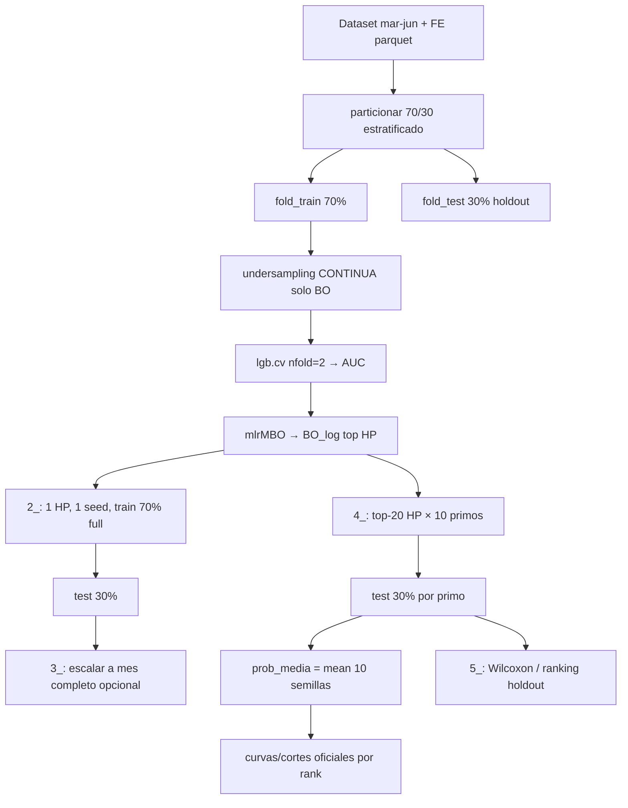

# compe1 — LightGBM con alcance variable de FE (parquet)

Tres experimentos paralelos bajo `juara/compe1/`, alineados con la línea R + lightgbm de [`juara/jueves/z494`](../jueves/z494/README.md). Los modelos leen features desde parquets en `juara/data/` (no desde `competencia_01.csv.gz` crudo). Claves de join: `numero_de_cliente`, `foto_mes`. La columna objetivo `clase_ternaria` viene en `competencia_01_nocontinuas_v1.parquet`.

## Experimentos

| Carpeta | Pregunta de negocio | Capas parquet |
|---------|---------------------|---------------|
| [`00`](00/README.md) | Baseline sin FE derivado: solo `competencia_01_v1.parquet` | 1 |
| [`01_full_fe`](01_full_fe/README.md) | ¿Cuánto aporta el FE completo (lags + rankings + deltas)? | 8 |
| [`02_rank_nocont`](02_rank_nocont/README.md) | ¿Basta nocontinuas del mes + percentiles `pct_*`? | 2 |
| [`02_rank_nocount_py`](02_rank_nocount_py/README.md) | Mismo alcance que `02_rank_nocont`; pipeline LightGBM en Python (Optuna) | 2 |
| [`03_rank_nocont_lag1_delta1`](03_rank_nocont_lag1_delta1/README.md) | ¿Intermedio sin lag2/delta2? | 5 |
| [`03_cont_nocont_lag1_delta1`](03_cont_nocont_lag1_delta1/README.md) | ¿Mismo protocolo con nivel continuo en lugar de percentiles `pct_*`? | 5 |

Nombres de archivo y rutas: [`juara/fe/paths.py`](../fe/paths.py) y [`common/compe1_layers.R`](common/compe1_layers.R).

## Parquets requeridos y generación FE

Premisa: `juara/data/competencia_01_crudo.csv` (o el gzip equivalente usado en el repo).

Orden sugerido (desde la raíz del repo):

1. `Rscript juara/generar_clase_ternaria_parquet.R` → `competencia_01_v1.parquet` (o `uv run python juara/fe/build_competencia_01_parquet_v1.py`)
2. `uv run python juara/fe/build_competencia_01_clean_v1.py` → `competencia_01_clean_v1.parquet`
3. `uv run python juara/fe/build_competencia_nocontinuas_v1.py` → `competencia_01_nocontinuas_v1.parquet`
4. `uv run python juara/fe/build_competencia_nocontinuas_v1_lag1.py` → `competencia_01_nocontinuas_v1_lag1.parquet`
5. `uv run python juara/fe/build_competencia_nocontinuas_v1_lag2.py` → `competencia_01_nocontinuas_v1_lag2.parquet`
6. `uv run python juara/fe/build_rankings_v1.py` → `rankings_v1.parquet`
7. `uv run python juara/fe/build_rankings_v1_lag1.py` → `rankings_v1_lag1.parquet`
8. `uv run python juara/fe/build_rankings_v1_lag2.py` → `rankings_v1_lag2.parquet`
9. `uv run python juara/fe/build_rankings_v1_delta1.py` → `rankings_v1_delta1.parquet`
10. `uv run python juara/fe/build_rankings_v1_delta2.py` → `rankings_v1_delta2.parquet`

Los `.parquet` suelen ser locales o gitignored; no hace falta tenerlos versionados para usar este layout.

## Estructura del modelo experimental

Referencia implementada: [`02_rank_nocont`](02_rank_nocont/README.md) (exp **2102**). Los demás experimentos replican el mismo protocolo de scripts numerados en `NN/00/`; solo cambian `EXPERIMENT_ID`, capas parquet y `EXPERIMENTO` / carpetas `HT####` / `exp####`.

### Datos y partición (única para todo el pipeline)

| Concepto | Definición |
|----------|------------|
| Ventana | `foto_mes` mar–jun 2021 (`202103`–`202106`) |
| Join | `numero_de_cliente`, `foto_mes` entre capas del experimento |
| Target binario | `clase01 = 1` si `BAJA+1` o `BAJA+2`; `0` si `CONTINUA` |
| Split | `particionar(division = c(70, 30), agrupa = clase_ternaria + foto_mes, seed = semilla_primigenia)` → `fold = 1` desarrollo, `fold = 2` test |
| Test holdout | El **30 %** no entra en BO ni en `lgb.cv`; solo evaluación offline |

La partición se **recomputa** en cada script con la misma semilla y agrupación para reproducir los mismos folds.

### Fase 1 — BO (`1_bayesiana_lightgbm.R`)

Solo usa el **70 %** (`fold_train`).

1. **Undersampling** (`compe1_aplicar_undersampling_train`): en dev, `CONTINUA` con probabilidad `undersampling` (p. ej. `0.1`); `BAJA+1`/`BAJA+2` siempre `training = 1`.
2. **Dtrain BO:** filas `fold == fold_train & training == 1`.
3. **Objetivo mlrMBO:** maximizar **AUC** de `lightgbm::lgb.cv` con **`nfold = 2`**, estratificado (`compe1_lgb_cv_best_auc`). Cada evaluación de BO = un CV completo sobre el pool undersampled; **no** se mira el 30 %.
4. **HP tunables (ej. 2102):** `num_iterations`, `num_leaves`, `min_data_in_leaf`, `min_sum_hessian_in_leaf` (+ fijos en `PARAM$lgbm$param_fijos`).
5. **Salida:** `HT####/bayesiana.RDATA`, `BO_log.txt` (todas las evaluaciones ordenables por `y`), `PARAM.yml` (mejor fila + metadatos).

### Fase 2 — Producción única (`2_produccion_lightgbm.R`)

| Entrenamiento | Evaluación |
|---------------|------------|
| **Todo** el 70 %, **sin** undersampling | Holdout **30 %** (`fold_test`) |
| Mejor HP de BO (1 fila de `BO_log`) | Una corrida `lgb.train`; semilla = `PARAM$lgbm$param_fijos$seed` (p. ej. `semilla_primigenia`) |
| `min_data_in_leaf` ← valor BO **÷** `undersampling` (equivalencia con el train BO muestreado) | `prediccion.txt`, curva y `cortes_ganancia.txt` en el test |

Salida: `exp####/` (`modelo.txt`, predicciones solo test).

### Fase 3 — Top-20 BO × semillas (`4_produccion_top20_bo_semillas.R`)

Compara **20** configuraciones de HP (primeras filas de `BO_log.txt` ya ordenado por AUC CV), no solo la mejor.

Por cada `rank_XX` (01–20):

1. **Train:** mismo 70 % completo que fase 2 (sin undersampling), mismo reescalado de `min_data_in_leaf`.
2. **Semillas:** **10** enteros primo (`compe1_semillas_primos(10, semilla_primigenia)`); cada modelo usa `param$seed = primo`.
3. **Test:** cada primo predice el **mismo** holdout 30 % → `prediccion_<primo>.txt`, `cortes_ganancia_<primo>.txt`.
4. **Promedio en test:** por `(numero_de_cliente, foto_mes)`, `prob_media = mean(prob)` sobre las 10 semillas → `prediccion_media.txt`, `curva_ganancia_media.pdf`, `cortes_ganancia_media.txt` (curva/cortes **oficiales** del rank).

Salida: `exp####_top20/rank_XX/`.

### Fase 4 — Inferencia entre ranks (`5_analisis_top20_bo_semillas.R`)

Sin reentrenar. Lee ganancia holdout **por semilla** y por corte (`seq(4000, 19000, by = 500)`).

- **Ranking operativo:** por rank, `max` sobre cortes de la **media** de ganancia holdout entre las 10 semillas → `ranking_por_max_holdout.tsv`, `ganador.yml`.
- **Contraste:** Wilcoxon emparejado por primo (ganador vs subcampeón / vs resto); Holm en 19 contrastes; curvas con media ± sd; opcional Friedman por envío.

La evidencia del ganador es **condicional al shortlist top-20** y a la métrica de negocio en holdout, no al AUC de BO.

### Fase opcional — Ganancia comparable por mes (`3_escalar_ganancia_mes.R`)

Escala la ganancia observada en el subconjunto test de cada `foto_mes` a “mes completo” (`compe1_escalar_ganancia_mes`) y promedia mar–jun. Aplica al flujo **2** (un solo HP); el estudio top-20 usa holdout **sin** escalar en inferencia.

### Ganancia de negocio (común)

Top-N clientes por `prob` (o `prob_media`): `+1_072_500` si `BAJA+2`, `-27_500` en caso contrario (`compe1_ganancia_envio`).

Procedimiento para elegir **envíos** con promedio de semillas (uno o varios modelos): [`common/seleccion_envios.md`](common/seleccion_envios.md).

Utilidades: [`common/compe1_data.R`](common/compe1_data.R) (`particionar`, `compe1_aplicar_undersampling_train`, `compe1_lgb_cv_best_auc`, `compe1_semillas_primos`, `compe1_preparar_holdout_split`).



## Convención de artefactos

Cada experimento tiene scripts numerados en `NN/00/` (p. ej. `1_bayesiana_lightgbm.R`). Los scripts crean `RESULTADOS_DIR` con `dir.create(...)`:

`juara/compe1/<experiment_id>/00/resultados/`

Ahí van modelo, predicciones, logs de BO y estudios, en la misma línea que z494 cuando se porte el entrenamiento.

Plantilla al inicio de un script en `NN/00/`:

```r
require("here")
here::i_am("juara/compe1/01_full_fe/00/1_ejemplo.R")
source(here("juara", "compe1", "common", "compe1_layers.R"))
DATA_DIR <- compe1_data_dir()
RESULTADOS_DIR <- compe1_resultados_dir("01_full_fe")
dir.create(RESULTADOS_DIR, recursive = TRUE, showWarnings = FALSE)
layers <- compe1_layers_paths("01_full_fe")
```

## Secuencia documentada (sin ejecutar aquí)

1. Generar parquets (sección anterior).
2. `Rscript juara/compe1/<experiment_id>/00/1_....R` (cuando existan los scripts).
