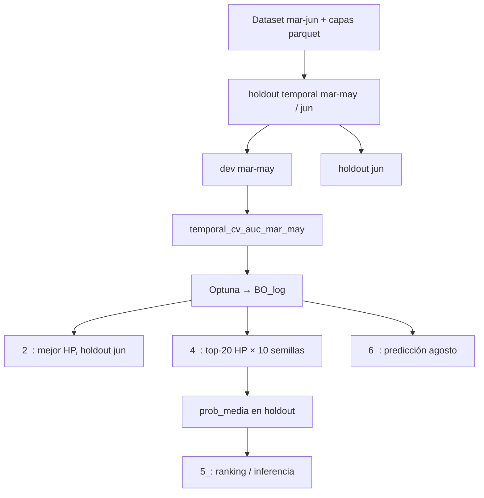

# compe1 — LightGBM sobre parquets (Python)

Pipelines bajo `juara/compe1/` entrenan LightGBM leyendo features desde `juara/data/*.parquet` (no desde CSV crudo). Claves de join: `numero_de_cliente`, `foto_mes`. La columna objetivo `clase_ternaria` entra en las capas de competencia / nocontinuas según el intento.

Rutas de parquets: [`juara/fe/paths.py`](../fe/paths.py). Capas por intento: [`common/layers.py`](common/layers.py).

## Intentos activos (`*py`)

| Intento | Iteración `00` → **experiment_id** | Pregunta / alcance | Capas | README |
|---------|----------------------------------|-------------------|-------|--------|
| [`00py`](00py/README.md) | `00py-00` | Baseline: solo `competencia_01_v1.parquet` | 1 | comandos, GCS, paridad |
| [`01py`](01py/README.md) | `01py-00` | FE completo: lags + rankings + deltas | 8 | prerequisitos FE |
| [`testpy`](testpy/README.md) | `testpy-00` | Mismo protocolo que `00py`; artefactos y GCS aislados | 1 | pruebas locales / VM |

Corridas históricas u otras variantes de alcance FE están en [`archivo/`](archivo/) (documentación propia; ids legados sin guión).

## Intentos Python: intento, iteración, `experiment_id`

Cada carpeta `00py`, `01py`, `testpy`, etc. es un **intento** de resolver la competencia (capas parquet y protocolo). Dentro del intento, subcarpetas `00`, `01`, … son **iteraciones** de ajustes menores (scripts numerados y artefactos).

| Concepto | Ejemplo | Uso |
|----------|---------|-----|
| Intento | `00py` | Carpeta padre; define FE en [`common/layers.py`](common/layers.py) |
| Iteración | `00` | `juara/compe1/<intento>/<iter>/` |
| **experiment_id** | `00py-00`, `testpy-00` | Id de corrida (`PARAM.yml`, cache, rutas de artefactos); `_bootstrap.EXPERIMENT_ID` en cada iteración |

Rutas locales y GCS (sin override): `juara/compe1/<experiment_id>/resultados/` ↔ `gs://<bucket>/compe1/<experiment_id>/resultados/` (p. ej. `testpy-00` ≠ `00py-00`).

Ids legados en `archivo/` (sin guión, p. ej. `03_rank_nocont_lag1_delta1`) usan layout `/<id>/00/resultados/`; ver [`common/layers.py`](common/layers.py).

## Parquets requeridos y generación FE

Premisa: `juara/data/competencia_01_crudo.csv` (o el gzip equivalente del repo).

Desde la raíz del repo (proyecto `uv` en `juara/`):

1. `uv run python juara/fe/build_competencia_01_parquet_v1.py` → `competencia_01_v1.parquet`
2. `uv run python juara/fe/build_competencia_01_clean_v1.py` → `competencia_01_clean_v1.parquet`
3. `uv run python juara/fe/build_competencia_nocontinuas_v1.py` → `competencia_01_nocontinuas_v1.parquet`
4. `uv run python juara/fe/build_competencia_nocontinuas_v1_lag1.py` → `competencia_01_nocontinuas_v1_lag1.parquet`
5. `uv run python juara/fe/build_competencia_nocontinuas_v1_lag2.py` → `competencia_01_nocontinuas_v1_lag2.parquet`
6. `uv run python juara/fe/build_rankings_v1.py` → `rankings_v1.parquet`
7. `uv run python juara/fe/build_rankings_v1_lag1.py` → `rankings_v1_lag1.parquet`
8. `uv run python juara/fe/build_rankings_v1_lag2.py` → `rankings_v1_lag2.parquet`
9. `uv run python juara/fe/build_rankings_v1_delta1.py` → `rankings_v1_delta1.parquet`
10. `uv run python juara/fe/build_rankings_v1_delta2_v1.py` → `rankings_v1_delta2_v1.parquet` (t0 − lag2)
11. `uv run python juara/fe/build_rankings_v1_delta2_v2.py` → `rankings_v1_delta2_v2.parquet` (lag1 − lag2)

Solo hace falta el subconjunto de pasos que exija cada intento (`00py`/`testpy`: paso 1; `01py`: pasos 2–9 y 11). Los `.parquet` suelen ser locales o gitignored.

Detalle FE: [`juara/fe/nota.md`](../fe/nota.md). VM: [`juara/gce.md`](../gce.md).

## Protocolo de scripts (referencia `00py` / `01py`)

Scripts en `compe1/<intento>/<iter>/`, ejecutados con `uv run python` desde `juara/`. Cada iteración importa `_bootstrap` y usa `EXPERIMENT_ID` compuesto.

### Datos y partición

| Concepto | Definición (intentos actuales) |
|----------|--------------------------------|
| Ventana | `foto_mes` mar–jun 2021 (`202103`–`202106`) |
| Join | `read_joined` entre capas del intento |
| Target binario | `clase01`: `BAJA+1` / `BAJA+2` → 1; `CONTINUA` → 0 |
| Split | Temporal mar–may (dev) / jun (holdout) vía `preparar_holdout_temporal` en [`common/data.py`](common/data.py) |
| Holdout | Junio no entra en BO ni en CV de entrenamiento; solo evaluación offline |

Otras variantes en `archivo/` pueden usar partición 70/30 estratificada (`preparar_holdout_split`, [`common/partition.py`](common/partition.py)).

### Fase 1 — `1_bayesiana_lightgbm.py`

Solo meses de desarrollo (mar–may).

1. **Objetivo Optuna:** maximizar `temporal_cv_auc_mar_may` ([`common/lgb_train.py`](common/lgb_train.py)): dos folds temporales (mar→abr, mar–abr→may).
2. **HP:** espacio en [`common/bo_space.py`](common/bo_space.py); fijos en `fixed_params_00` / `merge_tuned`.
3. **Salida:** `bo/` con `optuna.db`, `BO_log.txt`, `PARAM.yml` (`experiment_id`, mejor trial, metadatos).

Variable `COMPE1_BO_ITER` (default `150`). Con `--vm`, sync GCS vía [`common/gcs_upload.py`](common/gcs_upload.py).

### Fase 2 — `2_produccion_lightgbm.py`

Entrenamiento en dev completo con mejor HP de BO; evaluación en holdout junio. Salida: `produccion/` (modelo, predicciones, cortes).

### Fase 3 — `4_produccion_top20_bo_semillas.py`

Top **20** filas de `BO_log.txt` × **10** semillas primo (`semillas_primos` en [`common/partition.py`](common/partition.py)). Por `rank_XX`: predicciones por semilla y `prob_media` en holdout. Salida: `top20/rank_XX/`, metadatos en `estudio/top20_bo_semillas/`.

### Fase 4 — `5_analisis_top20_bo_semillas.py`

Sin reentrenar: ranking por ganancia holdout entre ranks, contrastes (Wilcoxon / Holm), curvas. Cortes típicos `4000`–`19000` paso `500` ([`common/cortes.py`](common/cortes.py)).

### Fase 5 — `6_prediccion_agosto_top20_semillas.py`

Inferencia sobre foto(s) de agosto con ranks elegidos; salida `agosto/`.

No hay script `3_escalar` en los intentos `*py` actuales.

### Ganancia de negocio

Top-N por `prob` o `prob_media`: `+1_072_500` si `BAJA+2`, `-27_500` en caso contrario (`ganancia_envio` en [`common/data.py`](common/data.py)).

Envíos agregados: [`common/seleccion_envios.md`](common/seleccion_envios.md). Export CSV: [`exportar_envio.py`](exportar_envio.py).



## Convención de artefactos

Por iteración Python:

`juara/compe1/<experiment_id>/resultados/`

Subcarpetas habituales: `bo/`, `produccion/`, `top20/`, `agosto/`, `estudio/`. Cache de split: `<experiment_id>/cache/`.

## Secuencia típica

1. Generar parquets FE necesarios (sección anterior).
2. Desde `juara/`:

```bash
uv run python compe1/00py/00/1_bayesiana_lightgbm.py
uv run python compe1/00py/00/2_produccion_lightgbm.py
uv run python compe1/00py/00/4_produccion_top20_bo_semillas.py
uv run python compe1/00py/00/5_analisis_top20_bo_semillas.py
uv run python compe1/00py/00/6_prediccion_agosto_top20_semillas.py
```

Sustituir `00py/00` por el intento e iteración correspondientes (`01py/00`, `testpy/00`, etc.).
