# Distribuciones nominales — top 20 drift (percentiles)

## Metodología

Valores leídos de `competencia_01.parquet` (columnas sin prefijo `pct_`). El ranking por drift proviene del informe previo sobre columnas `pct_*` (`drift_por_columna.csv`): score principal = media de D de Kolmogorov–Smirnov entre meses consecutivos.

- Filas en competencia: 983,061
- Meses (`foto_mes`): 202103, 202104, 202105, 202106, 202107, 202108
- Columnas analizadas: 20

Métricas por mes en `resumen_por_mes.csv`: cobertura, cuantiles sobre no-nulos, % en cero y cardinalidad. Las KDE en `plots/` usan la misma grilla que `densidades_rankings_por_mes.py`; montos muy asimétricos pueden concentrar densidad cerca de 0 — los cuantiles del CSV complementan la lectura.

## Índice

| Rank | Columna nominal | KS media (pct) | Gráfico |
| ---: | --- | ---: | --- |
| 1 | `mcuenta_corriente_adicional` | 0.9995 | [plots/plot_mcuenta_corriente_adicional.png](plots/plot_mcuenta_corriente_adicional.png) |
| 2 | `mcaja_ahorro_adicional` | 0.9765 | [plots/plot_mcaja_ahorro_adicional.png](plots/plot_mcaja_ahorro_adicional.png) |
| 3 | `Master_msaldodolares` | 0.9589 | [plots/plot_Master_msaldodolares.png](plots/plot_Master_msaldodolares.png) |
| 4 | `Visa_msaldodolares` | 0.8534 | [plots/plot_Visa_msaldodolares.png](plots/plot_Visa_msaldodolares.png) |
| 5 | `mcomisiones_mantenimiento` | 0.6799 | [plots/plot_mcomisiones_mantenimiento.png](plots/plot_mcomisiones_mantenimiento.png) |
| 6 | `Visa_Finiciomora` | 0.6161 | [plots/plot_Visa_Finiciomora.png](plots/plot_Visa_Finiciomora.png) |
| 7 | `Master_msaldopesos` | 0.5361 | [plots/plot_Master_msaldopesos.png](plots/plot_Master_msaldopesos.png) |
| 8 | `Master_msaldototal` | 0.5342 | [plots/plot_Master_msaldototal.png](plots/plot_Master_msaldototal.png) |
| 9 | `mcuenta_corriente` | 0.5032 | [plots/plot_mcuenta_corriente.png](plots/plot_mcuenta_corriente.png) |
| 10 | `mcaja_ahorro_dolares` | 0.4476 | [plots/plot_mcaja_ahorro_dolares.png](plots/plot_mcaja_ahorro_dolares.png) |
| 11 | `Master_Finiciomora` | 0.4314 | [plots/plot_Master_Finiciomora.png](plots/plot_Master_Finiciomora.png) |
| 12 | `Master_mconsumospesos` | 0.3452 | [plots/plot_Master_mconsumospesos.png](plots/plot_Master_mconsumospesos.png) |
| 13 | `Master_mconsumototal` | 0.3452 | [plots/plot_Master_mconsumototal.png](plots/plot_Master_mconsumototal.png) |
| 14 | `cproductos` | 0.3058 | [plots/plot_cproductos.png](plots/plot_cproductos.png) |
| 15 | `ccomisiones_mantenimiento` | 0.3016 | [plots/plot_ccomisiones_mantenimiento.png](plots/plot_ccomisiones_mantenimiento.png) |
| 16 | `cpayroll_trx` | 0.2633 | [plots/plot_cpayroll_trx.png](plots/plot_cpayroll_trx.png) |
| 17 | `ccuenta_debitos_automaticos` | 0.2237 | [plots/plot_ccuenta_debitos_automaticos.png](plots/plot_ccuenta_debitos_automaticos.png) |
| 18 | `Visa_fultimo_cierre` | 0.2042 | [plots/plot_Visa_fultimo_cierre.png](plots/plot_Visa_fultimo_cierre.png) |
| 19 | `ctransferencias_recibidas` | 0.1948 | [plots/plot_ctransferencias_recibidas.png](plots/plot_ctransferencias_recibidas.png) |
| 20 | `ccomisiones_otras` | 0.1827 | [plots/plot_ccomisiones_otras.png](plots/plot_ccomisiones_otras.png) |

---

## 1. `mcuenta_corriente_adicional` (`pct_mcuenta_corriente_adicional`)

KS media en percentiles: 0.9995; par máx. KS: 202107-202108.

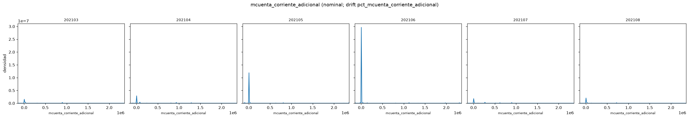

| Mes | n | % null | p50 | p25 | p75 | % cero |
| ---: | ---: | ---: | ---: | ---: | ---: | ---: |
| 202103 | 162900 | 0.00 | 0.0000 | 0.0000 | 0.0000 | 99.95 |
| 202104 | 163284 | 0.00 | 0.0000 | 0.0000 | 0.0000 | 99.95 |
| 202105 | 163768 | 0.00 | 0.0000 | 0.0000 | 0.0000 | 99.95 |
| 202106 | 164114 | 0.00 | 0.0000 | 0.0000 | 0.0000 | 99.95 |
| 202107 | 164348 | 0.00 | 0.0000 | 0.0000 | 0.0000 | 99.95 |
| 202108 | 164647 | 0.00 | 0.0000 | 0.0000 | 0.0000 | 99.95 |

Concentración en cero: hasta 100.0% de los no-nulos en algún mes. En espacio pct el par de mayor KS fue 202107-202108 (rank drift 1).

## 2. `mcaja_ahorro_adicional` (`pct_mcaja_ahorro_adicional`)

KS media en percentiles: 0.9765; par máx. KS: 202106-202107.

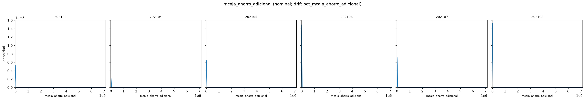

| Mes | n | % null | p50 | p25 | p75 | % cero |
| ---: | ---: | ---: | ---: | ---: | ---: | ---: |
| 202103 | 162900 | 0.00 | 0.0000 | 0.0000 | 0.0000 | 97.65 |
| 202104 | 163284 | 0.00 | 0.0000 | 0.0000 | 0.0000 | 97.64 |
| 202105 | 163768 | 0.00 | 0.0000 | 0.0000 | 0.0000 | 97.66 |
| 202106 | 164114 | 0.00 | 0.0000 | 0.0000 | 0.0000 | 97.66 |
| 202107 | 164348 | 0.00 | 0.0000 | 0.0000 | 0.0000 | 97.66 |
| 202108 | 164647 | 0.00 | 0.0000 | 0.0000 | 0.0000 | 97.65 |

Concentración en cero: hasta 97.7% de los no-nulos en algún mes. En espacio pct el par de mayor KS fue 202106-202107 (rank drift 2).

## 3. `Master_msaldodolares` (`pct_Master_msaldodolares`)

KS media en percentiles: 0.9589; par máx. KS: 202103-202107.

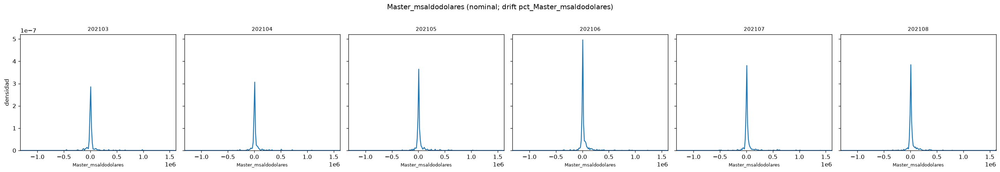

| Mes | n | % null | p50 | p25 | p75 | % cero |
| ---: | ---: | ---: | ---: | ---: | ---: | ---: |
| 202103 | 162900 | 10.34 | 0.0000 | 0.0000 | 0.0000 | 96.23 |
| 202104 | 163284 | 10.30 | 0.0000 | 0.0000 | 0.0000 | 96.12 |
| 202105 | 163768 | 10.23 | 0.0000 | 0.0000 | 0.0000 | 96.04 |
| 202106 | 164114 | 10.11 | 0.0000 | 0.0000 | 0.0000 | 95.58 |
| 202107 | 164348 | 9.69 | 0.0000 | 0.0000 | 0.0000 | 95.97 |
| 202108 | 164647 | 10.15 | 0.0000 | 0.0000 | 0.0000 | 95.83 |

Concentración en cero: hasta 96.2% de los no-nulos en algún mes. En espacio pct el par de mayor KS fue 202103-202107 (rank drift 3).

## 4. `Visa_msaldodolares` (`pct_Visa_msaldodolares`)

KS media en percentiles: 0.8534; par máx. KS: 202103-202107.

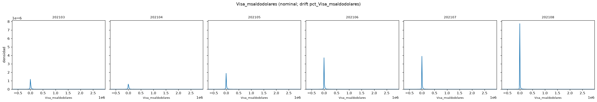

| Mes | n | % null | p50 | p25 | p75 | % cero |
| ---: | ---: | ---: | ---: | ---: | ---: | ---: |
| 202103 | 162900 | 4.85 | 0.0000 | 0.0000 | 0.0000 | 86.51 |
| 202104 | 163284 | 4.89 | 0.0000 | 0.0000 | 0.0000 | 86.09 |
| 202105 | 163768 | 4.91 | 0.0000 | 0.0000 | 0.0000 | 85.94 |
| 202106 | 164114 | 4.95 | 0.0000 | 0.0000 | 0.0000 | 84.26 |
| 202107 | 164348 | 4.40 | 0.0000 | 0.0000 | 0.0000 | 85.58 |
| 202108 | 164647 | 4.81 | 0.0000 | 0.0000 | 0.0000 | 85.34 |

Concentración en cero: hasta 86.5% de los no-nulos en algún mes. En espacio pct el par de mayor KS fue 202103-202107 (rank drift 4).

## 5. `mcomisiones_mantenimiento` (`pct_mcomisiones_mantenimiento`)

KS media en percentiles: 0.6799; par máx. KS: 202104-202108.

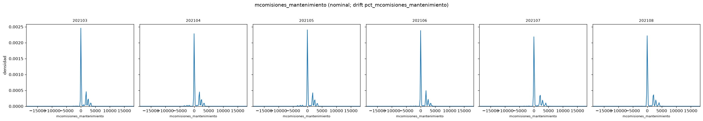

| Mes | n | % null | p50 | p25 | p75 | % cero |
| ---: | ---: | ---: | ---: | ---: | ---: | ---: |
| 202103 | 162900 | 0.00 | 0.0000 | 0.0000 | 1774.0400 | 67.45 |
| 202104 | 163284 | 0.00 | 0.0000 | 0.0000 | 1774.0400 | 66.42 |
| 202105 | 163768 | 0.00 | 0.0000 | 0.0000 | 1622.8100 | 68.90 |
| 202106 | 164114 | 0.00 | 0.0000 | 0.0000 | 1774.0400 | 68.29 |
| 202107 | 164348 | 0.00 | 0.0000 | 0.0000 | 1947.3600 | 69.08 |
| 202108 | 164647 | 0.00 | 0.0000 | 0.0000 | 2047.9900 | 70.26 |

Concentración en cero: hasta 70.3% de los no-nulos en algún mes. En espacio pct el par de mayor KS fue 202104-202108 (rank drift 5).

## 6. `Visa_Finiciomora` (`pct_Visa_Finiciomora`)

KS media en percentiles: 0.6161; par máx. KS: 202107-202108.

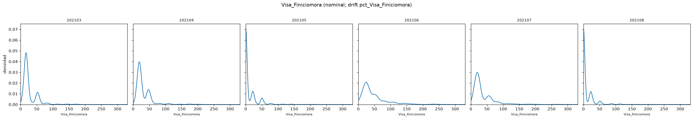

| Mes | n | % null | p50 | p25 | p75 | % cero |
| ---: | ---: | ---: | ---: | ---: | ---: | ---: |
| 202103 | 162900 | 99.09 | 17.0000 | 17.0000 | 24.0000 | 0.00 |
| 202104 | 163284 | 99.13 | 19.0000 | 19.0000 | 47.0000 | 0.00 |
| 202105 | 163768 | 97.35 | 0.0000 | 0.0000 | 15.0000 | 74.17 |
| 202106 | 164114 | 99.43 | 24.0000 | 24.0000 | 52.0000 | 0.00 |
| 202107 | 164348 | 99.40 | 20.0000 | 20.0000 | 55.0000 | 0.00 |
| 202108 | 164647 | 97.47 | 0.0000 | 0.0000 | 0.0000 | 78.04 |

La mediana varía un 100.0% entre meses consecutivos (mayor salto en 202104-202105). Concentración en cero: hasta 78.0% de los no-nulos en algún mes. En espacio pct el par de mayor KS fue 202107-202108 (rank drift 6).

## 7. `Master_msaldopesos` (`pct_Master_msaldopesos`)

KS media en percentiles: 0.5361; par máx. KS: 202103-202107.

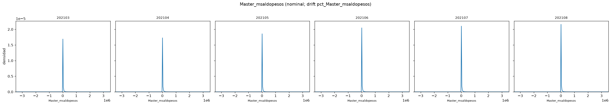

| Mes | n | % null | p50 | p25 | p75 | % cero |
| ---: | ---: | ---: | ---: | ---: | ---: | ---: |
| 202103 | 162900 | 10.34 | 0.0000 | 0.0000 | 6383.1900 | 56.05 |
| 202104 | 163284 | 10.30 | 0.0000 | 0.0000 | 6997.7300 | 54.73 |
| 202105 | 163768 | 10.23 | 0.0000 | 0.0000 | 7390.6125 | 54.42 |
| 202106 | 164114 | 10.11 | 0.0000 | 0.0000 | 8807.3675 | 52.85 |
| 202107 | 164348 | 9.69 | 0.0000 | 0.0000 | 8131.9300 | 53.22 |
| 202108 | 164647 | 10.15 | 0.0000 | 0.0000 | 8754.0200 | 52.89 |

Concentración en cero: hasta 56.0% de los no-nulos en algún mes. En espacio pct el par de mayor KS fue 202103-202107 (rank drift 7).

## 8. `Master_msaldototal` (`pct_Master_msaldototal`)

KS media en percentiles: 0.5342; par máx. KS: 202103-202107.

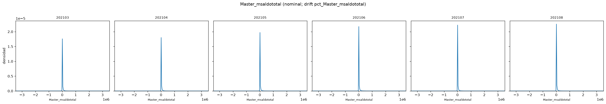

| Mes | n | % null | p50 | p25 | p75 | % cero |
| ---: | ---: | ---: | ---: | ---: | ---: | ---: |
| 202103 | 162900 | 10.34 | 0.0000 | 0.0000 | 6406.7500 | 55.86 |
| 202104 | 163284 | 10.30 | 0.0000 | 0.0000 | 7027.7800 | 54.54 |
| 202105 | 163768 | 10.23 | 0.0000 | 0.0000 | 7427.7450 | 54.22 |
| 202106 | 164114 | 10.11 | 0.0000 | 0.0000 | 8872.3950 | 52.67 |
| 202107 | 164348 | 9.69 | 0.0000 | 0.0000 | 8178.6550 | 53.03 |
| 202108 | 164647 | 10.15 | 0.0000 | 0.0000 | 8796.3650 | 52.70 |

Concentración en cero: hasta 55.9% de los no-nulos en algún mes. En espacio pct el par de mayor KS fue 202103-202107 (rank drift 8).

## 9. `mcuenta_corriente` (`pct_mcuenta_corriente`)

KS media en percentiles: 0.5032; par máx. KS: 202103-202107.

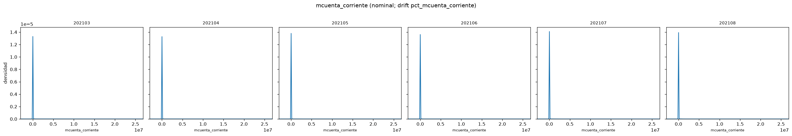

| Mes | n | % null | p50 | p25 | p75 | % cero |
| ---: | ---: | ---: | ---: | ---: | ---: | ---: |
| 202103 | 162900 | 0.00 | 0.0000 | -960.7650 | 0.0000 | 48.73 |
| 202104 | 163284 | 0.00 | 0.0000 | -1285.7700 | 0.0000 | 47.12 |
| 202105 | 163768 | 0.00 | 0.0000 | -1072.1000 | 0.0000 | 48.21 |
| 202106 | 164114 | 0.00 | 0.0000 | -914.3300 | 0.0000 | 49.64 |
| 202107 | 164348 | 0.00 | 0.0000 | -655.7150 | 0.0000 | 52.51 |
| 202108 | 164647 | 0.00 | 0.0000 | -979.9000 | 0.0000 | 49.16 |

Concentración en cero: hasta 52.5% de los no-nulos en algún mes. En espacio pct el par de mayor KS fue 202103-202107 (rank drift 9).

## 10. `mcaja_ahorro_dolares` (`pct_mcaja_ahorro_dolares`)

KS media en percentiles: 0.4476; par máx. KS: 202104-202106.

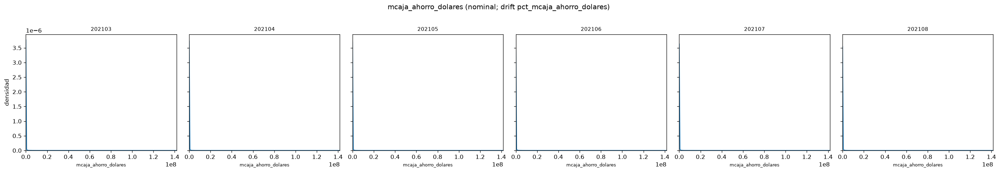

| Mes | n | % null | p50 | p25 | p75 | % cero |
| ---: | ---: | ---: | ---: | ---: | ---: | ---: |
| 202103 | 162900 | 0.00 | 7.5500 | 0.0000 | 17083.2850 | 44.24 |
| 202104 | 163284 | 0.00 | 6.5800 | 0.0000 | 13722.9875 | 44.63 |
| 202105 | 163768 | 0.00 | 5.5400 | 0.0000 | 11485.0025 | 44.94 |
| 202106 | 164114 | 0.00 | 5.6100 | 0.0000 | 11251.2000 | 44.95 |
| 202107 | 164348 | 0.00 | 6.8000 | 0.0000 | 15364.1400 | 44.47 |
| 202108 | 164647 | 0.00 | 8.0200 | 0.0000 | 18149.0900 | 44.33 |

La mediana varía un 21.2% entre meses consecutivos (mayor salto en 202106-202107). En espacio pct el par de mayor KS fue 202104-202106 (rank drift 10).

## 11. `Master_Finiciomora` (`pct_Master_Finiciomora`)

KS media en percentiles: 0.4314; par máx. KS: 202103-202107.

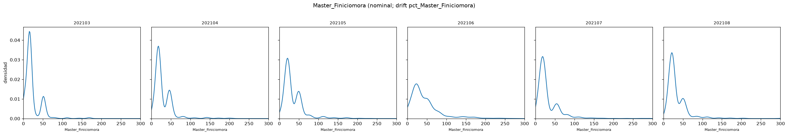

| Mes | n | % null | p50 | p25 | p75 | % cero |
| ---: | ---: | ---: | ---: | ---: | ---: | ---: |
| 202103 | 162900 | 99.31 | 16.0000 | 16.0000 | 23.0000 | 0.00 |
| 202104 | 163284 | 99.40 | 18.0000 | 18.0000 | 46.0000 | 0.00 |
| 202105 | 163768 | 99.50 | 21.0000 | 21.0000 | 49.0000 | 0.00 |
| 202106 | 164114 | 99.60 | 23.0000 | 23.0000 | 51.0000 | 0.15 |
| 202107 | 164348 | 99.58 | 19.0000 | 19.0000 | 39.0000 | 0.00 |
| 202108 | 164647 | 99.66 | 22.0000 | 22.0000 | 50.0000 | 0.00 |

La mediana varía un 17.4% entre meses consecutivos (mayor salto en 202106-202107). En espacio pct el par de mayor KS fue 202103-202107 (rank drift 11).

## 12. `Master_mconsumospesos` (`pct_Master_mconsumospesos`)

KS media en percentiles: 0.3452; par máx. KS: 202106-202107.

| Mes | n | % null | p50 | p25 | p75 | % cero |
| ---: | ---: | ---: | ---: | ---: | ---: | ---: |
| 202103 | 162900 | 59.85 | 1562.3600 | 0.0000 | 9379.1950 | 35.37 |
| 202104 | 163284 | 59.84 | 1952.2400 | 0.0000 | 10575.2000 | 31.46 |
| 202105 | 163768 | 59.38 | 1767.4500 | 0.0000 | 10949.7600 | 33.91 |
| 202106 | 164114 | 58.41 | 2615.7000 | 0.0000 | 13568.3900 | 30.83 |
| 202107 | 164348 | 57.90 | 1517.7700 | 0.0000 | 10567.2000 | 35.93 |
| 202108 | 164647 | 58.30 | 1968.8800 | 0.0000 | 12036.9700 | 33.48 |

La mediana varía un 48.0% entre meses consecutivos (mayor salto en 202105-202106). En espacio pct el par de mayor KS fue 202106-202107 (rank drift 12).

## 13. `Master_mconsumototal` (`pct_Master_mconsumototal`)

KS media en percentiles: 0.3452; par máx. KS: 202106-202107.

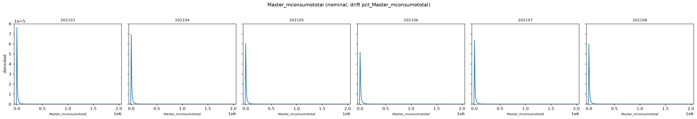

| Mes | n | % null | p50 | p25 | p75 | % cero |
| ---: | ---: | ---: | ---: | ---: | ---: | ---: |
| 202103 | 162900 | 59.85 | 1562.3600 | 0.0000 | 9379.1950 | 35.37 |
| 202104 | 163284 | 59.84 | 1952.2400 | 0.0000 | 10575.2000 | 31.46 |
| 202105 | 163768 | 59.38 | 1767.4500 | 0.0000 | 10949.7600 | 33.91 |
| 202106 | 164114 | 58.41 | 2615.7000 | 0.0000 | 13568.3900 | 30.83 |
| 202107 | 164348 | 57.90 | 1517.7700 | 0.0000 | 10567.2000 | 35.93 |
| 202108 | 164647 | 58.30 | 1968.8800 | 0.0000 | 12036.9700 | 33.48 |

La mediana varía un 48.0% entre meses consecutivos (mayor salto en 202105-202106). En espacio pct el par de mayor KS fue 202106-202107 (rank drift 13).

## 14. `cproductos` (`pct_cproductos`)

KS media en percentiles: 0.3058; par máx. KS: 202104-202105.

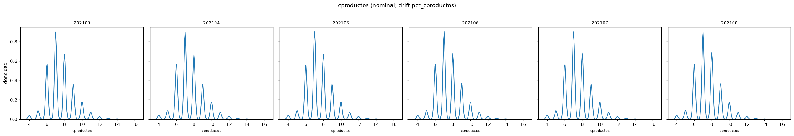

| Mes | n | % null | p50 | p25 | p75 | % cero |
| ---: | ---: | ---: | ---: | ---: | ---: | ---: |
| 202103 | 162900 | 0.00 | 7.0000 | 7.0000 | 8.0000 | 0.00 |
| 202104 | 163284 | 0.00 | 7.0000 | 7.0000 | 8.0000 | 0.00 |
| 202105 | 163768 | 0.00 | 7.0000 | 7.0000 | 8.0000 | 0.00 |
| 202106 | 164114 | 0.00 | 7.0000 | 7.0000 | 8.0000 | 0.00 |
| 202107 | 164348 | 0.00 | 7.0000 | 7.0000 | 8.0000 | 0.00 |
| 202108 | 164647 | 0.00 | 7.0000 | 7.0000 | 8.0000 | 0.00 |

En espacio pct el par de mayor KS fue 202104-202105 (rank drift 14).

## 15. `ccomisiones_mantenimiento` (`pct_ccomisiones_mantenimiento`)

KS media en percentiles: 0.3016; par máx. KS: 202103-202104.

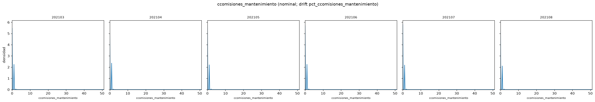

| Mes | n | % null | p50 | p25 | p75 | % cero |
| ---: | ---: | ---: | ---: | ---: | ---: | ---: |
| 202103 | 162900 | 0.00 | 0.0000 | 0.0000 | 1.0000 | 67.22 |
| 202104 | 163284 | 0.00 | 0.0000 | 0.0000 | 1.0000 | 66.14 |
| 202105 | 163768 | 0.00 | 0.0000 | 0.0000 | 1.0000 | 68.47 |
| 202106 | 164114 | 0.00 | 0.0000 | 0.0000 | 1.0000 | 67.89 |
| 202107 | 164348 | 0.00 | 0.0000 | 0.0000 | 1.0000 | 68.95 |
| 202108 | 164647 | 0.00 | 0.0000 | 0.0000 | 1.0000 | 70.09 |

Concentración en cero: hasta 70.1% de los no-nulos en algún mes. En espacio pct el par de mayor KS fue 202103-202104 (rank drift 15).

## 16. `cpayroll_trx` (`pct_cpayroll_trx`)

KS media en percentiles: 0.2633; par máx. KS: 202103-202104.

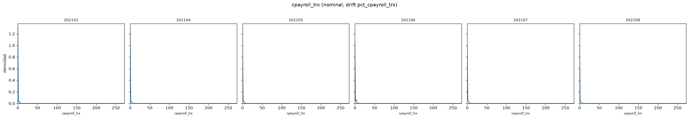

| Mes | n | % null | p50 | p25 | p75 | % cero |
| ---: | ---: | ---: | ---: | ---: | ---: | ---: |
| 202103 | 162900 | 0.00 | 1.0000 | 0.0000 | 1.0000 | 45.97 |
| 202104 | 163284 | 0.00 | 1.0000 | 0.0000 | 1.0000 | 45.90 |
| 202105 | 163768 | 0.00 | 1.0000 | 0.0000 | 1.0000 | 45.04 |
| 202106 | 164114 | 0.00 | 1.0000 | 0.0000 | 2.0000 | 44.73 |
| 202107 | 164348 | 0.00 | 1.0000 | 0.0000 | 1.0000 | 44.83 |
| 202108 | 164647 | 0.00 | 1.0000 | 0.0000 | 1.0000 | 44.25 |

Coincide con el par de mayor KS en percentiles (202103-202104).

## 17. `ccuenta_debitos_automaticos` (`pct_ccuenta_debitos_automaticos`)

KS media en percentiles: 0.2237; par máx. KS: 202107-202108.

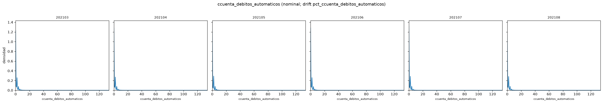

| Mes | n | % null | p50 | p25 | p75 | % cero |
| ---: | ---: | ---: | ---: | ---: | ---: | ---: |
| 202103 | 162900 | 0.00 | 0.0000 | 0.0000 | 2.0000 | 52.01 |
| 202104 | 163284 | 0.00 | 0.0000 | 0.0000 | 2.0000 | 51.94 |
| 202105 | 163768 | 0.00 | 0.0000 | 0.0000 | 1.0000 | 52.21 |
| 202106 | 164114 | 0.00 | 0.0000 | 0.0000 | 1.0000 | 53.10 |
| 202107 | 164348 | 0.00 | 0.0000 | 0.0000 | 2.0000 | 51.67 |
| 202108 | 164647 | 0.00 | 0.0000 | 0.0000 | 2.0000 | 51.73 |

Concentración en cero: hasta 53.1% de los no-nulos en algún mes. En espacio pct el par de mayor KS fue 202107-202108 (rank drift 17).

## 18. `Visa_fultimo_cierre` (`pct_Visa_fultimo_cierre`)

KS media en percentiles: 0.2042; par máx. KS: 202103-202104.

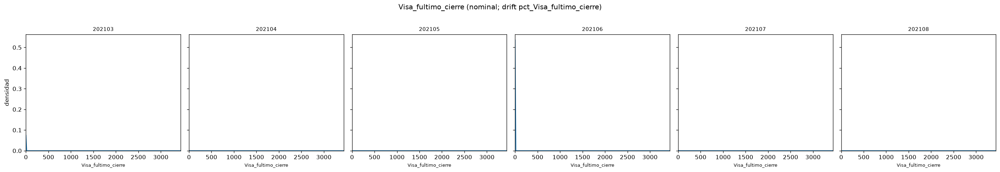

| Mes | n | % null | p50 | p25 | p75 | % cero |
| ---: | ---: | ---: | ---: | ---: | ---: | ---: |
| 202103 | 162900 | 4.86 | 1.0000 | 1.0000 | 7.0000 | 0.00 |
| 202104 | 163284 | 4.92 | 2.0000 | 2.0000 | 9.0000 | 0.00 |
| 202105 | 163768 | 4.97 | 5.0000 | 5.0000 | 12.0000 | 0.00 |
| 202106 | 164114 | 4.97 | 0.0000 | 0.0000 | 7.0000 | 72.64 |
| 202107 | 164348 | 4.42 | 3.0000 | 3.0000 | 10.0000 | 0.00 |
| 202108 | 164647 | 4.88 | 6.0000 | 6.0000 | 13.0000 | 0.00 |

La mediana varía un 150.0% entre meses consecutivos (mayor salto en 202104-202105). Concentración en cero: hasta 72.6% de los no-nulos en algún mes. En espacio pct el par de mayor KS fue 202103-202104 (rank drift 18).

## 19. `ctransferencias_recibidas` (`pct_ctransferencias_recibidas`)

KS media en percentiles: 0.1948; par máx. KS: 202104-202105.

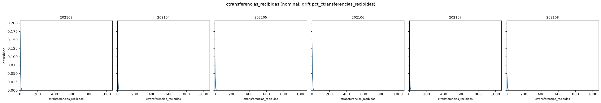

| Mes | n | % null | p50 | p25 | p75 | % cero |
| ---: | ---: | ---: | ---: | ---: | ---: | ---: |
| 202103 | 162900 | 0.00 | 2.0000 | 1.0000 | 4.0000 | 24.67 |
| 202104 | 163284 | 0.00 | 2.0000 | 0.0000 | 3.0000 | 26.60 |
| 202105 | 163768 | 0.00 | 2.0000 | 0.0000 | 3.0000 | 26.65 |
| 202106 | 164114 | 0.00 | 2.0000 | 1.0000 | 4.0000 | 24.44 |
| 202107 | 164348 | 0.00 | 2.0000 | 1.0000 | 4.0000 | 23.64 |
| 202108 | 164647 | 0.00 | 2.0000 | 1.0000 | 4.0000 | 23.42 |

En espacio pct el par de mayor KS fue 202104-202105 (rank drift 19).

## 20. `ccomisiones_otras` (`pct_ccomisiones_otras`)

KS media en percentiles: 0.1827; par máx. KS: 202105-202106.

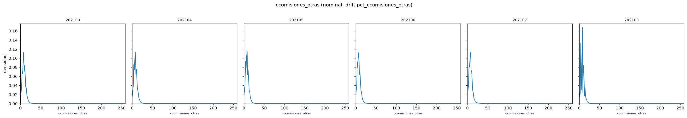

| Mes | n | % null | p50 | p25 | p75 | % cero |
| ---: | ---: | ---: | ---: | ---: | ---: | ---: |
| 202103 | 162900 | 0.00 | 8.0000 | 6.0000 | 12.0000 | 2.33 |
| 202104 | 163284 | 0.00 | 8.0000 | 6.0000 | 10.0000 | 2.52 |
| 202105 | 163768 | 0.00 | 8.0000 | 4.0000 | 10.0000 | 2.65 |
| 202106 | 164114 | 0.00 | 8.0000 | 4.0000 | 10.0000 | 2.53 |
| 202107 | 164348 | 0.00 | 8.0000 | 6.0000 | 10.0000 | 2.91 |
| 202108 | 164647 | 0.00 | 8.0000 | 6.0000 | 10.0000 | 2.93 |

En espacio pct el par de mayor KS fue 202105-202106 (rank drift 20).

## Síntesis

- **Productos adicionales (montos m*)** (4 columnas en el top): KS media pct ~0.732. Ejemplos: `mcuenta_corriente_adicional`, `mcaja_ahorro_adicional`, `mcuenta_corriente`.
- **Saldos USD tarjetas** (4 columnas en el top): KS media pct ~0.721. Ejemplos: `Master_msaldodolares`, `Visa_msaldodolares`, `Master_msaldopesos`.
- **Mora y fechas codificadas** (3 columnas en el top): KS media pct ~0.417. Ejemplos: `Visa_Finiciomora`, `Master_Finiciomora`, `Visa_fultimo_cierre`.
- **Conteos (c*)** (6 columnas en el top): KS media pct ~0.245. Ejemplos: `cproductos`, `ccomisiones_mantenimiento`, `cpayroll_trx`.
- **Otros montos y comisiones** (3 columnas en el top): KS media pct ~0.457. Ejemplos: `mcomisiones_mantenimiento`, `Master_mconsumospesos`, `Master_mconsumototal`.
