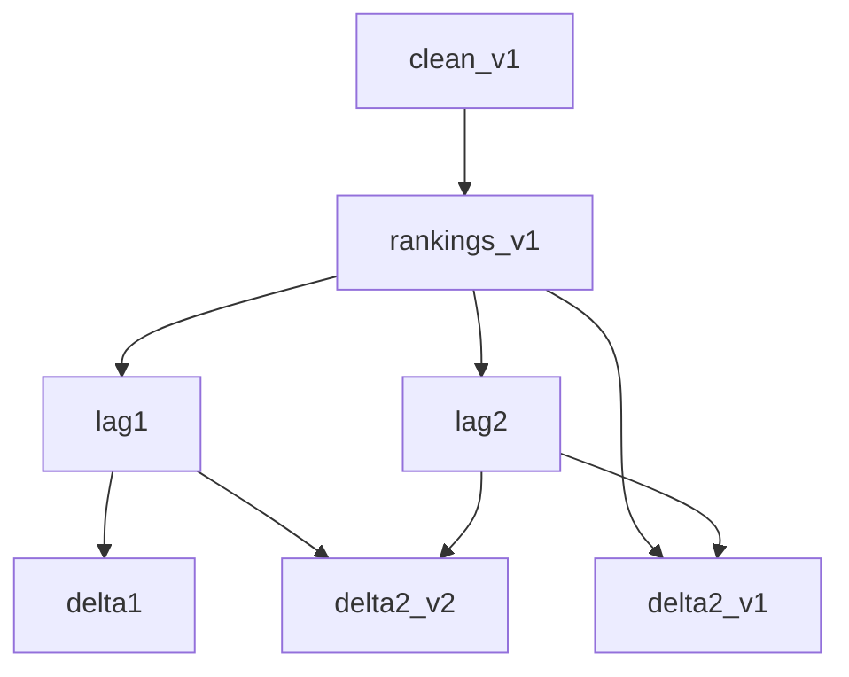

# Versionado del pipeline FE

Los scripts `build_*` son **inmutables**: si cambia la lógica de cálculo o las entradas materializadas, crear un script nuevo con token de versión en el nombre y escribir un Parquet distinto. No hay alias hacia nombres sin versión.

**Crudo (sin versión):** `competencia_01_crudo.csv` — [`download_competencia_crudo.py`](download_competencia_crudo.py).

## Convención de nombres

| Tipo | Patrón | Ejemplo |
|------|--------|---------|
| Script base | `build_<familia>_vN.py` | `build_rankings_v1.py` |
| Derivado (capa) | `build_<familia>_vN_<capa>.py` | `build_rankings_v1_lag1.py` |
| Derivado (proceso versionado) | `build_<familia>_v<branch>_<capa>_v<step>.py` | `build_rankings_v1_delta2_v2.py` |
| Parquet | alineado al script | `rankings_v1_delta2_v2.parquet` |

- `_v<branch>` en el nombre del script/Parquet es la versión del artefacto **base de esa familia** (p. ej. rankings v1, continuas v1).
- `_v<step>` al final versiona solo el **paso** (p. ej. dos fórmulas distintas de delta2 sobre la misma rama v1).

Las entradas de cada builder van **hardcodeadas** en el script vía helpers de [`paths.py`](paths.py). Cambiar qué Parquet se lee implica nuevo script y nuevo nombre de salida.

## Ramificación (no “misma N en toda la cadena”)

Cada paso versiona de forma independiente. Un derivado puede leer artefactos de ramas anteriores si su versión de proceso no cambió (ej. `delta2_v2` lee `rankings_v1_lag1` + `rankings_v1_lag2`).

Cuando cambia la **base** de una familia (ej. futuro `rankings_v2` con lógica distinta), se re-materializan solo los pasos downstream que correspondan (`lag1_v2`, `lag2_v2`, …); el número del paso delta2 en esa rama es independiente (ej. `delta2_v3` sobre lags v2).

Ventana temporal en lags/delta1 (desde base): `PARTITION BY numero_de_cliente ORDER BY foto_mes`. **delta2** usa JOIN entre capas lag ya materializadas (ejecutar `lag1` y `lag2` antes que `delta2_v*`).

## Cadena v1 (entrada FE = `competencia_01_clean_v1.parquet`)

| Script | Lee | Escribe |
|--------|-----|---------|
| `build_competencia_01_parquet_v1.py` | `competencia_01_crudo.csv` | `competencia_01_v1.parquet` |
| `build_competencia_01_clean_v1.py` | `competencia_01_v1.parquet` | `competencia_01_clean_v1.parquet` |
| `build_competencia_nocontinuas_v1.py` | clean v1 | `competencia_01_nocontinuas_v1.parquet` |
| `build_competencia_continuas_v1.py` | clean v1 | `competencia_01_continuas_v1.parquet` |
| `build_rankings_v1.py` | clean v1 | `rankings_v1.parquet` |
| `build_competencia_nocontinuas_v1_lag1.py` | nocontinuas v1 | `competencia_01_nocontinuas_v1_lag1.parquet` |
| `build_competencia_nocontinuas_v1_lag2.py` | nocontinuas v1 | `competencia_01_nocontinuas_v1_lag2.parquet` |
| `build_competencia_continuas_v1_lag1.py` | continuas v1 | `competencia_01_continuas_v1_lag1.parquet` |
| `build_competencia_continuas_v1_lag2.py` | continuas v1 | `competencia_01_continuas_v1_lag2.parquet` |
| `build_competencia_continuas_v1_delta1.py` | continuas v1 | `competencia_01_continuas_v1_delta1.parquet` |
| `build_competencia_continuas_v1_delta2_v1.py` | continuas v1 + `continuas_v1_lag2` | `competencia_01_continuas_v1_delta2_v1.parquet` |
| `build_competencia_continuas_v1_delta2_v2.py` | `continuas_v1_lag1` + `continuas_v1_lag2` | `competencia_01_continuas_v1_delta2_v2.parquet` |
| `build_rankings_v1_lag1.py` | `rankings_v1.parquet` | `rankings_v1_lag1.parquet` |
| `build_rankings_v1_lag2.py` | `rankings_v1.parquet` | `rankings_v1_lag2.parquet` |
| `build_rankings_v1_delta1.py` | `rankings_v1.parquet` | `rankings_v1_delta1.parquet` |
| `build_rankings_v1_delta2_v1.py` | `rankings_v1` + `rankings_v1_lag2` | `rankings_v1_delta2_v1.parquet` |
| `build_rankings_v1_delta2_v2.py` | `rankings_v1_lag1` + `rankings_v1_lag2` | `rankings_v1_delta2_v2.parquet` |

**Semántica delta2:**

| Paso | Fórmula | Entradas (rankings) |
|------|---------|---------------------|
| `delta2_v1` | t0 − lag2 | base JOIN lag2 |
| `delta2_v2` | lag1 − lag2 | lag1 JOIN lag2 |

`delta1` sigue siendo t0 − lag1 desde la base. Análogo para continuas.

## Checklist: solo cambia un paso

1. Copiar el script hermano más cercano; ajustar lógica y helpers `paths.py` de **entrada** y **salida**.
2. Nuevo token `_v<step>` (o sufijo de capa) en script y Parquet.
3. Actualizar fila en esta tabla y en [`README.md`](README.md) si afecta el índice.
4. Si un experimento usará el artefacto: `layers.py` / `compe1_layers.R`.
5. Probar desde `juara/`: `uv run fe/<script>.py`.

## Checklist: cambia la base de una familia (ej. rankings)

1. Nuevo `build_rankings_v2.py` (solo cuando haya cambio real de proceso/input).
2. Re-materializar lags/deltas downstream en esa rama (`build_rankings_v2_lag1.py`, …).
3. Helpers en `paths.py` por cada artefacto nuevo.
4. Documentar la rama en esta nota; no asumir que delta2 reutiliza el mismo `_v<step>` que la rama v1.

Alternativa labeled: `Rscript juara/generar_clase_ternaria_parquet.R` escribe `competencia_01_v1.parquet` (misma semántica que el builder Python de parquet v1).

**Migración:** parquets ya generados con nombres antiguos (`rankings_v1_delta2.parquet`, `rankings_v2*.parquet`) no se renombran solos; re-ejecutar builders o renombrar en el almacén.
