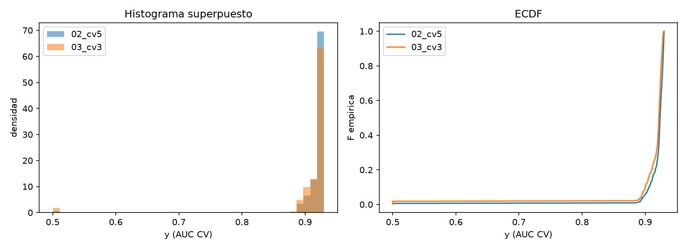
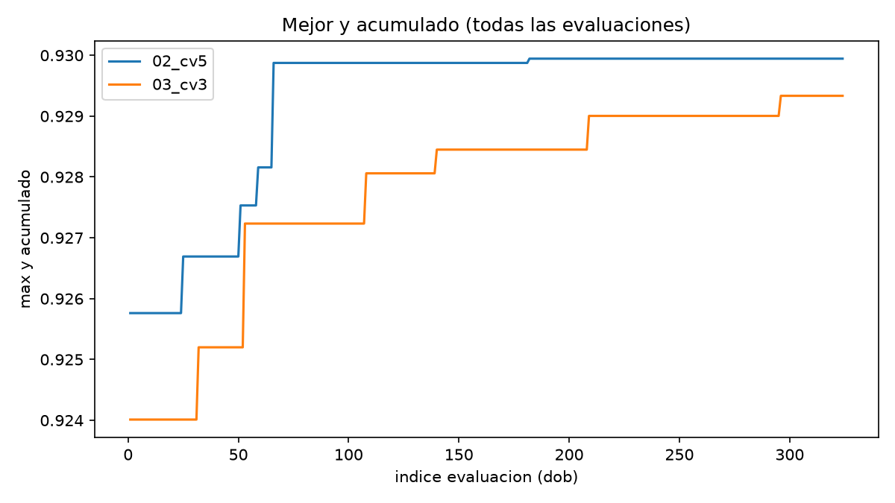
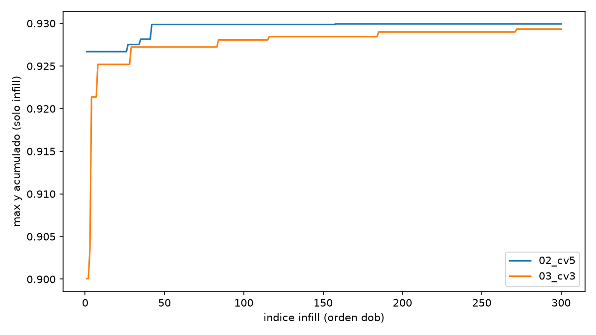
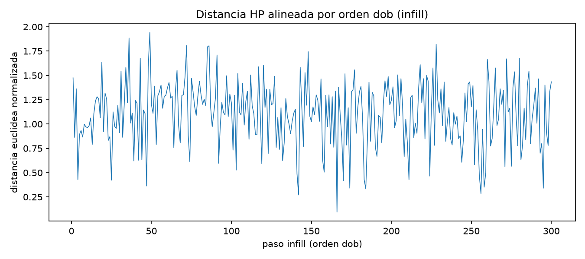
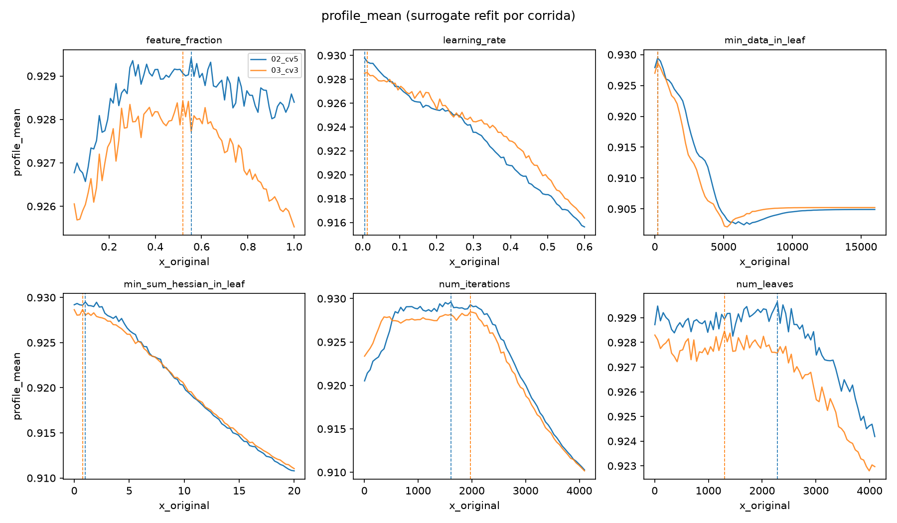

# Informe BO: `02` (CV 5) vs `03` (CV 3)

Generado: 2026-09-17 14:08 UTC

## 1. Supuestos

- Mismo espacio de hiperparametros (6 tunables), semilla `427417`, 24 init + 300 infill.
- Unico cambio operativo: folds de `lgb.cv` (5 en `02`, 3 en `03`).
- Sin comparacion de produccion Kaggle ni script 6.

## 2. Resultados diferentes?

- `y_max`: **0.929944** (`02`) vs **0.929334** (`03`); delta 0.000611 AUC.
- Medianas: 0.923558 vs 0.921656; p90: 0.928866 vs 0.927082.
- Suma `exec.time`: 5744.1 s vs 2750.7 s.

Tabla resumen: [objetivo_resumen.tsv](estudio/objetivo_resumen.tsv)



Init vs infill: [objetivo_por_prop_type.tsv](estudio/objetivo_por_prop_type.tsv)

- Mann-Whitney (todas): p = 0.0000 (n 324 vs 324).
- Mann-Whitney (infill_ei): p = 0.0000 (n 300 vs 300).

- Jaccard bins top-10: 0.0000.
- Jaccard bins top-30: 0.0000.

**Conclusion:** el maximo y la distribucion difieren; la brecha en `y_max` es del orden de 1e-3 AUC. El cambio de folds altera el objetivo incluso con HP identicos en init.

## 3. Recorrido similar?

- chamfer_infill_norm: 0.272003.
- chamfer_recheck: 0.272003.
- infill_row_min_mean: 0.264251.
- infill_row_min_median: 0.246911.
- infill_lsa_mean: 0.336655.
- infill_lsa_median: 0.311343.







[Matriz distancia infill](estudio/02_03_distancia_infill.tsv); [heatmap top-10](estudio/02_03_top10_similitud_infill.html); [coordenadas paralelas](estudio/trayectoria_parallel_coords_top30.html).

**Conclusion:** Chamfer infill normalizado ~0.272 (escala moderada). Las curvas cummax divergen tras el init; la alineacion por `dob` muestra HP distintos en cada paso.

## 4. Regiones de alto rendimiento similares?

Empirico (top fraccion por `y`): [regiones_empiricas_top.tsv](estudio/regiones_empiricas_top.tsv)

| HP | solapamiento intervalo p10-p90 |
|---|---:|
| num_iterations | 0.848 |
| learning_rate | 0.221 |
| feature_fraction | 0.742 |
| num_leaves | 0.994 |
| min_data_in_leaf | 0.484 |
| min_sum_hessian_in_leaf | 0.905 |



Nota: `profile_mean` proviene de un surrogate refit por corrida; no comparar magnitud absoluta, solo forma y ubicacion del maximo.

| parametro | x_argmax 02 | x_argmax 03 | dist_norm |
|---|---:|---:|---:|
| feature_fraction | 0.555063 | 0.518987 | 0.040 |
| learning_rate | 0.005000 | 0.012532 | 0.026 |
| min_data_in_leaf | 203.518987 | 203.518987 | 0.000 |
| min_sum_hessian_in_leaf | 1.012663 | 0.759498 | 0.025 |
| num_iterations | 1609.721519 | 1972.303797 | 0.178 |
| num_leaves | 2283.088608 | 1298.936709 | 0.482 |

**Conclusion:** solapamiento empirico variable por HP; perfiles 1D sugieren mesetas parecidas con maximos desplazados en algunas dimensiones.

## 5. Reproducibilidad

```bash
cd /home/fdevlocal/server/projects/dmeyf2026
uv run --project juara python juara/jueves/z494/common/run_informe_bo_02_vs_03.py
```

Scripts: `bo_comparar_objetivo.py`, `bo_comparar_trayectoria.py`, `bo_comparar_regiones.py`, `generar_informe_md.py`; reutiliza `bo_distancia_chamfer.py`, `bo_distancia_infill.py`, `bo_similitud_infill*.py`.

- `BO_log` 02: 67233 B sha256:da44500f616cb7ce
- `BO_log` 03: 67134 B sha256:5f08b392fbeafe1e
