# Informe ejecutivo multimensual de bajas

## Resumen ejecutivo

Se analizaron 5098 episodios BAJA y 101960 episodios CONTINUA en 8 estratos ancla–horizonte. 112 variables cumplen el criterio de persistencia.

- El análisis es descriptivo: compara BAJA con CONTINUA comparable al ancla y no atribuye causas.
- Las prioridades por segmento son exploratorias: se sustentan en una segmentación aceptada
  para descripción, no en riesgo causal ni eficacia de tratamiento.

## Alcance y calidad de datos

- Fuente: `data/competencia_01.parquet`; fotos observadas: 202103, 202104, 202105, 202106, 202107, 202108.
- Anclas configuradas y válidas: 202103, 202104, 202105, 202106; horizontes BAJA+1 y BAJA+2.
- CONTINUA se seleccionó de forma determinista por `(foto_mes_ancla, horizonte_evento)`, con razón 20:1 y semilla 2026; se excluyeron clientes BAJA.
- Semántica de BAJA: un cliente rotulado BAJA+1 en la foto `t` deja de estar en la base en `t+1`; para BAJA+2 deja de estar en `t+2`. En este informe `mes_relativo=0` es esa primera foto sin registro, no una observación. BAJA+1 se ancla en `t=-1` y BAJA+2 en `t=-2`.
- Las trayectorias BAJA y sus comparaciones se restringen a `mes_relativo<0`. No se publican niveles posteriores a la baja ni se interpreta la ausencia como saldo cero.
- Los tamaños de cohorte proceden de `tablas/cohorte_resumen_mensual.csv`; la auditoría por estrato de `tablas/auditoria_cohorte.parquet`.

| grupo | cobertura mínima | cobertura máxima |
| --- | --- | --- |
| BAJA | 0.991 | 1.000 |
| CONTINUA | 0.950 | 1.000 |

## Evolución multimensual

Tamaños observados por mes de ancla:

| foto_mes_ancla | n_baja | n_continua | n_total_cohorte | tasa_baja_cohorte | ratio_controles_por_baja_medio |
| --- | --- | --- | --- | --- | --- |
| 202103 | 1979 | 39580 | 41559 | 0.048 | 20.0 |
| 202104 | 1143 | 22860 | 24003 | 0.048 | 20.0 |
| 202105 | 874 | 17480 | 18354 | 0.048 | 20.0 |
| 202106 | 1102 | 22040 | 23142 | 0.048 | 20.0 |

La evolución se lee sólo antes de la desaparición (`mes_relativo<0`) y se separa por mes
calendario en `tablas/trayectorias_nivel_calendario.csv`; los denominadores están en
`tablas/denominadores_metricas.csv`. Las trayectorias no prueban cambio individual ni causalidad.

## Hallazgos persistentes

El criterio exige una dirección con IC95% fuera de cero en al menos 75% de las anclas y al
menos tres anclas. Las filas siguientes son diferencias BAJA−CONTINUA ponderadas por estrato:

| variable | n_anclas_evaluadas | diff_baja_menos_continua | cohens_d_ponderado | ic95_lo | ic95_hi | n_estratos_ponderados |
| --- | --- | --- | --- | --- | --- | --- |
| active_quarter | 4 | -0.140 | -1.108 | -0.149 | -0.128 | 5 |
| ctarjeta_visa | 4 | -0.231 | -0.961 | -0.245 | -0.219 | 5 |
| ctrx_quarter | 4 | -82.5 | -0.961 | -85.8 | -81.4 | 5 |
| Master_status | 4 | 0.481 | 0.881 | 0.424 | 0.550 | 5 |
| Visa_Finiciomora | 4 | 21.8 | 0.859 | 14.3 | 30.5 | 5 |
| cproductos | 4 | -1.213 | -0.816 | -1.264 | -1.174 | 5 |
| ctarjeta_master | 4 | -0.249 | -0.797 | -0.262 | -0.232 | 5 |
| Visa_status | 4 | 0.426 | 0.775 | 0.367 | 0.482 | 5 |

Dominios con efecto medio absoluto (lectura agregada, no causal):

| dominio | n_vars | mean_abs_cohens_d | max_abs_cohens_d |
| --- | --- | --- | --- |
| nocontinuas_base | 28 | 0.306 | 1.108 |
| continuas_nivel | 126 | 0.197 | 1.181 |

## Perfiles cuantitativos y prioridades sugeridas

- Estado: **aceptada para descripción exploratoria**.
- AUC temporal media/mínima: **0.906 / 0.892**.
- Predictores permitidos al ancla: **28**.

Tamaño y composición de los segmentos aceptados:
| cluster | n | peso | BAJA+1 | BAJA+2 |
| --- | --- | --- | --- | --- |
| 0 | 1836 | 0.360 | 349 | 1487 |
| 1 | 3262 | 0.640 | 682 | 2580 |

Distribución por ancla y evento esperado:
| cluster | foto_mes_ancla | mes_evento_esperado | n | peso_cluster |
| --- | --- | --- | --- | --- |
| 0 | 202103 | 202105 | 335 | 0.182 |
| 0 | 202103 | 202104 | 346 | 0.188 |
| 0 | 202104 | 202106 | 380 | 0.207 |
| 0 | 202104 | 202105 | 1 | 0.001 |
| 0 | 202105 | 202106 | 1 | 0.001 |
| 0 | 202105 | 202107 | 358 | 0.195 |
| 0 | 202106 | 202107 | 1 | 0.001 |
| 0 | 202106 | 202108 | 414 | 0.225 |

Rasgos distintivos del modelo (no son causas):
| cluster | rango | variable | direccion_vs_continua | mean_shap |
| --- | --- | --- | --- | --- |
| 0 | 1 | mpayroll | mayor | 0.893 |
| 0 | 2 | mcuentas_saldo | mayor | 0.209 |
| 0 | 3 | ctrx_quarter | mayor | 0.193 |
| 1 | 1 | ctrx_quarter | mayor | 1.564 |
| 1 | 2 | mpayroll | mayor | 0.761 |
| 1 | 3 | mcuentas_saldo | mayor | 0.542 |

Media y mediana al ancla de las diez variables con mayor importancia global SHAP (misma selección para todos los segmentos):
| cluster | rango_importancia_global | variable | n | media_ancla | mediana_ancla | n_continua_emparejada | media_continua_emparejada | brecha_vs_continua |
| --- | --- | --- | --- | --- | --- | --- | --- | --- |
| 0 | 1 | ctrx_quarter | 1836 | 85.2 | 66.0 | 101960 | 120.5 | -35.4 |
| 0 | 2 | mpayroll | 1836 | 15.163 | 0.000 | 101960 | 83.370 | -68.208 |
| 0 | 3 | mcuentas_saldo | 1836 | 78.157 | 6.181 | 101960 | 229.415 | -151.257 |
| 0 | 4 | mprestamos_personales | 1836 | 10.482 | 0.000 | 101960 | 33.447 | -22.965 |
| 0 | 5 | Visa_msaldototal | 1678 | 26.132 | 11.117 | 101960 | 37.404 | -11.272 |
| 0 | 6 | ctarjeta_visa_transacciones | 1836 | 8.701 | 5.000 | 101960 | 12.9 | -4.217 |
| 0 | 7 | mrentabilidad_annual | 1836 | 18.045 | 8.713 | 101960 | 24.166 | -6.122 |
| 0 | 8 | mrentabilidad | 1836 | 2.173 | 1.496 | 101960 | 2.193 | -19.4 |
| 0 | 9 | mcomisiones | 1836 | 1.599 | 1.592 | 101960 | 1.581 | 18.2 |
| 0 | 10 | ctarjeta_visa | 1836 | 0.895 | 1.000 | 101960 | 0.957 | -0.062 |
| 1 | 1 | ctrx_quarter | 3262 | 11.5 | 9.000 | 101960 | 120.6 | -109.1 |
| 1 | 2 | mpayroll | 3262 | 3.422 | 0.000 | 101960 | 83.135 | -79.713 |
| 1 | 3 | mcuentas_saldo | 3262 | -2.290 | -3.175 | 101960 | 228.729 | -231.019 |
| 1 | 4 | mprestamos_personales | 3262 | 18.851 | 0.000 | 101960 | 33.373 | -14.522 |
| 1 | 5 | Visa_msaldototal | 2219 | 8.081 | 0.000 | 101960 | 37.225 | -29.144 |
| 1 | 6 | ctarjeta_visa_transacciones | 3262 | 1.247 | 0.000 | 101960 | 12.9 | -11.7 |
| 1 | 7 | mrentabilidad_annual | 3262 | 17.136 | 9.737 | 101960 | 24.166 | -7.030 |
| 1 | 8 | mrentabilidad | 3262 | 2.182 | 1.797 | 101960 | 2.196 | -13.8 |
| 1 | 9 | mcomisiones | 3262 | 1.373 | 1.592 | 101960 | 1.587 | -214.0 |
| 1 | 10 | ctarjeta_visa | 3262 | 0.632 | 1.000 | 101960 | 0.957 | -0.325 |

Descriptivos de edad y antigüedad al ancla:
| cluster | variable | n | media | mediana | p10 | p25 | p75 | p90 | minimo | maximo |
| --- | --- | --- | --- | --- | --- | --- | --- | --- | --- | --- |
| 0 | cliente_antiguedad | 1836 | 130.2 | 121.0 | 34.5 | 62.0 | 181.0 | 252.0 | 1.000 | 378.0 |
| 0 | cliente_edad | 1836 | 47.6 | 46.0 | 31.0 | 36.0 | 58.0 | 66.0 | 20.0 | 92.0 |
| 1 | cliente_antiguedad | 3262 | 99.2 | 72.0 | 18.1 | 41.0 | 145.0 | 210.0 | 1.000 | 378.0 |
| 1 | cliente_edad | 3262 | 47.9 | 46.0 | 31.0 | 37.0 | 59.0 | 68.0 | 19.0 | 90.0 |

Las distribuciones completas por intervalos comparables están en `tablas/cluster_edad_antiguedad_distribucion.csv`.

Niveles y brechas por dominio frente a CONTINUA emparejada:
| cluster | dominio | variable | media_segmento | media_continua_emparejada | brecha_vs_continua |
| --- | --- | --- | --- | --- | --- |
| 0 | productos | cproductos | 6.960 | 7.566 | -0.606 |
| 0 | canales | ctrx_quarter | 85.2 | 120.5 | -35.4 |
| 0 | saldos | mcuentas_saldo | 78.157 | 229.415 | -151.257 |
| 0 | rentabilidad | mrentabilidad | 2.173 | 2.193 | -19.4 |
| 1 | productos | cproductos | 6.013 | 7.567 | -1.553 |
| 1 | canales | ctrx_quarter | 11.5 | 120.6 | -109.1 |
| 1 | saldos | mcuentas_saldo | -2.290 | 228.729 | -231.019 |
| 1 | rentabilidad | mrentabilidad | 2.182 | 2.196 | -13.8 |

Proxy financiero operativo al ancla por segmento frente a CONTINUA emparejada:
| cluster | variable | n_segmento | media_segmento | mediana_segmento | n_continua_emparejada | media_continua_emparejada | mediana_continua_emparejada | brecha_media_vs_continua | brecha_mediana_vs_continua |
| --- | --- | --- | --- | --- | --- | --- | --- | --- | --- |
| 0 | deuda_total_operativa | 1836 | 50.106 | 13.274 | 101960 | 109.490 | 33.287 | -59.384 | -20.013 |
| 0 | patrimonio_liquido_operativo | 1836 | 28.051 | -2.358 | 101960 | 119.659 | 1.149 | -91.608 | -3.508 |
| 1 | deuda_total_operativa | 3262 | 28.551 | 0.000 | 101960 | 108.956 | 33.142 | -80.405 | -33.142 |
| 1 | patrimonio_liquido_operativo | 3262 | -30.841 | -8.321 | 101960 | 119.258 | 1.159 | -150.099 | -9.480 |

`deuda_total_operativa` suma préstamos personales, prendarios e hipotecarios y los saldos Visa/Master truncados inferiormente en cero; `patrimonio_liquido_operativo` es `mcuentas_saldo − deuda_total_operativa` con nulos tratados como cero.
Ambas medidas son proxies operativos, no patrimonio neto contable. Se excluyen `mactivos_margen` y `mpasivos_margen` porque representan márgenes, no saldos.

Evolución pre-evento de rentabilidad por segmento (promedio de brecha BAJA−CONTINUA en las fotos previas disponibles):
| cluster | mes_relativo_min | mes_relativo_max | brecha_media_vs_continua |
| --- | --- | --- | --- |
| 0 | -5 | -1 | -135.3 |
| 1 | -5 | -1 | -25.0 |

- Prioridad exploratoria C1: 3262 episodios (0.640 de BAJA); medir en una prueba controlada intervenciones de contacto u oferta alrededor de `ctrx_quarter, mpayroll, mcuentas_saldo`. El tamaño prioriza capacidad de prueba, no riesgo causal.
- Prioridad exploratoria C0: 1836 episodios (0.360 de BAJA); medir en una prueba controlada intervenciones de contacto u oferta alrededor de `mpayroll, mcuentas_saldo, ctrx_quarter`. El tamaño prioriza capacidad de prueba, no riesgo causal.

## Estados y transiciones pre-evento

Los estados se puntuaron en cada foto BAJA previa al evento con el mismo LightGBM y el mismo KMeans ajustados al ancla. La asignación de cada ancla reproduce `cluster_asignaciones_baja.csv` antes de publicar transiciones.
- Umbral publicado: **20 pares consecutivos** por `(foto_mes_ancla, horizonte_evento)`.
- Estratos publicables: **4** de **8**; pares incluidos: **10208**.
- Permanencia entre pares: **0.928** (9468 pares); migración: **0.072** (740 pares).
- Episodios con trayecto completo hasta `-1`: **5098**; cambio entre el primer estado observable y `-1`: **0.102**.

Matriz agregada, ponderada por pares observados de los estratos publicables:
| estado_origen | estado_destino | n_pares | n_pares_origen | n_estratos_contributivos | probabilidad |
| --- | --- | --- | --- | --- | --- |
| 0 | 0 | 3690 | 4201 | 4 | 0.878 |
| 0 | 1 | 511 | 4201 | 4 | 0.122 |
| 1 | 0 | 229 | 6007 | 4 | 0.038 |
| 1 | 1 | 5778 | 6007 | 4 | 0.962 |

Cobertura por estrato, incluidos los no publicables:
| foto_mes_ancla | horizonte_evento | n_episodios | n_fotos_pre_evento | n_pares_observados | publicable | motivo_no_publicable |
| --- | --- | --- | --- | --- | --- | --- |
| 202103 | 1 | 1019 | 1019 | 0 | no | Soporte insuficiente: 0 pares observados < mínimo 20. |
| 202103 | 2 | 960 | 1920 | 960 | sí |  |
| 202104 | 1 | 4 | 4 | 0 | no | Soporte insuficiente: 0 pares observados < mínimo 20. |
| 202104 | 2 | 1139 | 3412 | 2273 | sí |  |
| 202105 | 1 | 4 | 4 | 0 | no | Soporte insuficiente: 0 pares observados < mínimo 20. |
| 202105 | 2 | 870 | 3467 | 2597 | sí |  |
| 202106 | 1 | 4 | 4 | 0 | no | Soporte insuficiente: 0 pares observados < mínimo 20. |
| 202106 | 2 | 1098 | 5476 | 4378 | sí |  |

La migración observada describe cambios de asignación SHAP en pares calendario consecutivos; no demuestra migración estructural, causalidad ni efecto de una intervención. Los estratos de soporte insuficiente permanecen desglosados y no se mezclan en la matriz agregada.

## Saldo previo de los episodios que terminan en C0

Aquí «terminan en C0» significa que el mismo modelo asigna C0 en `t=-1`, la última foto observable antes de que el cliente desaparezca. No equivale necesariamente a C0 al ancla: para BAJA+2 el ancla ocurre en `t=-2`.
La tabla reconstruye sólo fotos previas (`t<0`) y pondera CONTINUA por `(foto_mes_ancla, horizonte_evento)` de esos episodios.
| meses antes de la desaparición | episodios C0 observados | saldo medio C0 terminal | saldo mediano C0 terminal | saldo medio CONTINUA ponderada | brecha media C0−CONTINUA |
| --- | --- | --- | --- | --- | --- |
| -5 | 380 | 111.884 | 20.533 | 231.600 | -119.716 |
| -4 | 719 | 121.790 | 14.828 | 221.928 | -100.138 |
| -3 | 1087 | 100.786 | 9.098 | 219.960 | -119.174 |
| -2 | 1411 | 96.173 | 8.024 | 231.750 | -135.577 |
| -1 | 1760 | 79.755 | 2.953 | 238.347 | -158.592 |
En la media de las fotos disponibles, el saldo de estos episodios pasa de **111.884** en `t=-5` a **79.755** en `t=-1`. En todos los meses observables, el saldo medio de C0 terminal quedó por debajo de la referencia CONTINUA ponderada por los mismos estratos.
La variación entre filas no identifica el cambio de cada cliente: el número de episodios observados cambia con el mes relativo. Por ello permite descartar o sustentar un patrón de niveles previos, no atribuir causalidad ni medir el saldo después de la baja.

## Histórico completo de variables relevantes: C0 terminal

Se publican las **30 variables**: las 28 admitidas por el clasificador y los dos proxies financieros operativos. Cada fila se refiere a los episodios cuyo último estado observable es C0 y sólo contiene fotos anteriores a la desaparición.
Los niveles son medias; las brechas restan la media CONTINUA ponderada por los mismos estratos. Los denominadores por variable y mes están en `tablas/cluster_ciclo_vida_c0_terminal_historico.csv`.

### Canales y transacciones

Niveles medios de C0 terminal:
| métrica | t=-5 | t=-4 | t=-3 | t=-2 | t=-1 |
| --- | --- | --- | --- | --- | --- |
| Transacciones Master | 1.650 | 1.773 | 1.609 | 1.547 | 1.340 |
| Transacciones Visa | 10.4 | 9.858 | 9.103 | 8.867 | 8.184 |
| Transacciones trimestrales | 94.0 | 93.0 | 88.6 | 86.8 | 81.7 |
| internet | 0.058 | 0.045 | 0.055 | 0.058 | 0.065 |
| thomebanking | 0.734 | 0.786 | 0.764 | 0.763 | 0.814 |
| tmobile_app | 0.024 | 0.029 | 0.044 | 0.049 | 0.084 |
Brecha media C0 terminal − CONTINUA ponderada:
| métrica | t=-5 | t=-4 | t=-3 | t=-2 | t=-1 |
| --- | --- | --- | --- | --- | --- |
| Transacciones Master | -0.596 | -0.551 | -0.728 | -0.882 | -1.082 |
| Transacciones Visa | -2.089 | -2.784 | -3.546 | -4.108 | -4.768 |
| Transacciones trimestrales | -25.7 | -27.2 | -31.5 | -33.8 | -39.6 |
| internet | 0.008 | -0.009 | 0.001 | 0.004 | 0.017 |
| thomebanking | -0.023 | 0.038 | 0.021 | 0.023 | 0.076 |
| tmobile_app | -0.007 | -0.003 | 0.014 | 0.019 | 0.056 |

### Finanzas operativas

Niveles medios de C0 terminal:
| métrica | t=-5 | t=-4 | t=-3 | t=-2 | t=-1 |
| --- | --- | --- | --- | --- | --- |
| Deuda total operativa | 58.617 | 52.332 | 53.523 | 46.446 | 47.215 |
| Patrimonio líquido operativo | 53.267 | 69.458 | 47.263 | 49.727 | 32.540 |
Brecha media C0 terminal − CONTINUA ponderada:
| métrica | t=-5 | t=-4 | t=-3 | t=-2 | t=-1 |
| --- | --- | --- | --- | --- | --- |
| Deuda total operativa | -43.763 | -53.701 | -53.624 | -64.650 | -64.907 |
| Patrimonio líquido operativo | -75.953 | -46.437 | -65.551 | -70.927 | -93.684 |

### Otros indicadores del clasificador

Niveles medios de C0 terminal:
| métrica | t=-5 | t=-4 | t=-3 | t=-2 | t=-1 |
| --- | --- | --- | --- | --- | --- |
| Actividad trimestral | 0.997 | 0.997 | 1.000 | 1.000 | 1.000 |
| Descubierto preacordado | 0.937 | 0.937 | 0.937 | 0.931 | 0.889 |
| Cliente VIP | 0.000 | 0.000 | 0.001 | 0.001 | 0.001 |
| Seguro automotor | 0.045 | 0.024 | 0.028 | 0.026 | 0.022 |
| Seguro de vida | 0.105 | 0.088 | 0.075 | 0.072 | 0.056 |
Brecha media C0 terminal − CONTINUA ponderada:
| métrica | t=-5 | t=-4 | t=-3 | t=-2 | t=-1 |
| --- | --- | --- | --- | --- | --- |
| Actividad trimestral | 0.006 | 0.006 | 0.010 | 0.011 | 0.010 |
| Descubierto preacordado | -0.030 | -0.030 | -0.029 | -0.035 | -0.076 |
| Cliente VIP | -0.002 | -0.003 | -0.002 | -0.003 | -0.002 |
| Seguro automotor | 0.012 | -0.010 | -0.006 | -0.008 | -0.013 |
| Seguro de vida | -0.010 | -0.030 | -0.041 | -0.045 | -0.061 |

### Perfil del cliente

Niveles medios de C0 terminal:
| métrica | t=-5 | t=-4 | t=-3 | t=-2 | t=-1 |
| --- | --- | --- | --- | --- | --- |
| Antigüedad (meses) | 124.0 | 128.9 | 129.1 | 129.1 | 130.4 |
| Edad (años) | 46.3 | 46.9 | 47.0 | 47.0 | 47.4 |
| Payroll | 23.745 | 38.047 | 30.120 | 20.722 | 15.237 |
| Cantidad de cuentas | 1.000 | 1.003 | 1.006 | 1.004 | 1.005 |
Brecha media C0 terminal − CONTINUA ponderada:
| métrica | t=-5 | t=-4 | t=-3 | t=-2 | t=-1 |
| --- | --- | --- | --- | --- | --- |
| Antigüedad (meses) | -10.5 | -5.272 | -5.511 | -5.745 | -5.345 |
| Edad (años) | -0.559 | 0.066 | 0.107 | 0.149 | 0.476 |
| Payroll | -49.911 | -37.967 | -45.052 | -63.580 | -67.795 |
| Cantidad de cuentas | -0.005 | -0.002 | 0.000 | -0.001 | 0.001 |

### Productos

Niveles medios de C0 terminal:
| métrica | t=-5 | t=-4 | t=-3 | t=-2 | t=-1 |
| --- | --- | --- | --- | --- | --- |
| ccuenta_corriente | 1.000 | 1.000 | 1.002 | 1.001 | 1.001 |
| cproductos | 7.258 | 7.227 | 7.119 | 7.028 | 6.787 |
| ctarjeta_debito | 1.455 | 1.473 | 1.473 | 1.454 | 1.453 |
| ctarjeta_master | 0.868 | 0.865 | 0.848 | 0.828 | 0.775 |
| ctarjeta_visa | 0.918 | 0.928 | 0.916 | 0.904 | 0.849 |
| Préstamos personales | 20.844 | 15.578 | 11.735 | 10.721 | 7.845 |
| Préstamos prendarios | 3.753 | 3.769 | 2.935 | 3.054 | 1.657 |
Brecha media C0 terminal − CONTINUA ponderada:
| métrica | t=-5 | t=-4 | t=-3 | t=-2 | t=-1 |
| --- | --- | --- | --- | --- | --- |
| ccuenta_corriente | -0.003 | -0.002 | -0.001 | -0.001 | -0.001 |
| cproductos | -0.301 | -0.340 | -0.445 | -0.535 | -0.781 |
| ctarjeta_debito | -0.025 | -0.010 | -0.011 | -0.027 | -0.025 |
| ctarjeta_master | -0.030 | -0.034 | -0.050 | -0.071 | -0.124 |
| ctarjeta_visa | -0.040 | -0.030 | -0.041 | -0.052 | -0.106 |
| Préstamos personales | -11.594 | -17.023 | -21.261 | -23.309 | -25.950 |
| Préstamos prendarios | -1.527 | -931.1 | -1.484 | -1.587 | -2.985 |

### Rentabilidad

Niveles medios de C0 terminal:
| métrica | t=-5 | t=-4 | t=-3 | t=-2 | t=-1 |
| --- | --- | --- | --- | --- | --- |
| mcomisiones | 1.587 | 1.353 | 1.249 | 1.525 | 1.701 |
| mrentabilidad | 2.363 | 1.771 | 1.905 | 2.296 | 2.176 |
| mrentabilidad_annual | 16.868 | 18.097 | 18.571 | 18.484 | 18.849 |
Brecha media C0 terminal − CONTINUA ponderada:
| métrica | t=-5 | t=-4 | t=-3 | t=-2 | t=-1 |
| --- | --- | --- | --- | --- | --- |
| mcomisiones | -181.9 | -227.8 | -321.0 | -13.5 | 106.7 |
| mrentabilidad | -78.4 | -362.7 | -234.9 | 138.9 | -127.2 |
| mrentabilidad_annual | -6.837 | -5.594 | -5.323 | -5.693 | -5.711 |

### Saldos

Niveles medios de C0 terminal:
| métrica | t=-5 | t=-4 | t=-3 | t=-2 | t=-1 |
| --- | --- | --- | --- | --- | --- |
| Saldo Master | 8.679 | 9.939 | 9.131 | 9.871 | 10.251 |
| Saldo Visa | 27.757 | 25.311 | 25.712 | 25.703 | 25.968 |
| Saldo de cuentas | 111.884 | 121.790 | 100.786 | 96.173 | 79.755 |
Brecha media C0 terminal − CONTINUA ponderada:
| métrica | t=-5 | t=-4 | t=-3 | t=-2 | t=-1 |
| --- | --- | --- | --- | --- | --- |
| Saldo Master | -2.020 | -1.139 | -2.430 | -2.264 | -2.134 |
| Saldo Visa | -7.573 | -10.306 | -10.601 | -12.239 | -12.506 |
| Saldo de cuentas | -119.716 | -100.138 | -119.174 | -135.577 | -158.592 |
Estas medias históricas no son trayectorias individuales: cambian los episodios observables y no se estima un efecto causal de ninguna variable.

## Saldo previo de los episodios que terminan en C1

Aquí «terminan en C1» significa que el mismo modelo asigna C1 en `t=-1`, la última foto observable antes de que el cliente desaparezca. No equivale necesariamente a C1 al ancla: para BAJA+2 el ancla ocurre en `t=-2`.
La tabla reconstruye sólo fotos previas (`t<0`) y pondera CONTINUA por `(foto_mes_ancla, horizonte_evento)` de esos episodios.
| meses antes de la desaparición | episodios C1 observados | saldo medio C1 terminal | saldo mediano C1 terminal | saldo medio CONTINUA ponderada | brecha media C1−CONTINUA |
| --- | --- | --- | --- | --- | --- |
| -5 | 708 | 3.251 | -1.085 | 231.600 | -228.348 |
| -4 | 1238 | 2.536 | -1.706 | 222.090 | -219.554 |
| -3 | 2009 | 105.5 | -2.636 | 219.723 | -219.617 |
| -2 | 2656 | -3.090 | -3.149 | 231.362 | -234.451 |
| -1 | 3338 | -8.171 | -3.271 | 237.243 | -245.414 |
En la media de las fotos disponibles, el saldo de estos episodios pasa de **3.251** en `t=-5` a **-8.171** en `t=-1`. En todos los meses observables, el saldo medio de C1 terminal quedó por debajo de la referencia CONTINUA ponderada por los mismos estratos.
La variación entre filas no identifica el cambio de cada cliente: el número de episodios observados cambia con el mes relativo. Por ello permite descartar o sustentar un patrón de niveles previos, no atribuir causalidad ni medir el saldo después de la baja.

## Histórico completo de variables relevantes: C1 terminal

Se publican las **30 variables**: las 28 admitidas por el clasificador y los dos proxies financieros operativos. Cada fila se refiere a los episodios cuyo último estado observable es C1 y sólo contiene fotos anteriores a la desaparición.
Los niveles son medias; las brechas restan la media CONTINUA ponderada por los mismos estratos. Los denominadores por variable y mes están en `tablas/cluster_ciclo_vida_c1_terminal_historico.csv`.

### Canales y transacciones

Niveles medios de C1 terminal:
| métrica | t=-5 | t=-4 | t=-3 | t=-2 | t=-1 |
| --- | --- | --- | --- | --- | --- |
| Transacciones Master | 0.350 | 0.334 | 0.205 | 0.155 | 0.087 |
| Transacciones Visa | 2.329 | 2.185 | 1.594 | 1.370 | 1.082 |
| Transacciones trimestrales | 22.8 | 20.3 | 15.4 | 12.8 | 11.3 |
| internet | 0.306 | 0.358 | 0.324 | 0.278 | 0.166 |
| thomebanking | 0.404 | 0.402 | 0.378 | 0.377 | 0.451 |
| tmobile_app | 0.007 | 0.015 | 0.013 | 0.012 | 0.016 |
Brecha media C1 terminal − CONTINUA ponderada:
| métrica | t=-5 | t=-4 | t=-3 | t=-2 | t=-1 |
| --- | --- | --- | --- | --- | --- |
| Transacciones Master | -1.896 | -1.994 | -2.125 | -2.275 | -2.321 |
| Transacciones Visa | -10.2 | -10.5 | -11.0 | -11.6 | -11.8 |
| Transacciones trimestrales | -96.9 | -100.0 | -104.7 | -107.8 | -110.0 |
| internet | 0.257 | 0.303 | 0.270 | 0.224 | 0.117 |
| thomebanking | -0.353 | -0.345 | -0.366 | -0.363 | -0.288 |
| tmobile_app | -0.024 | -0.017 | -0.017 | -0.019 | -0.012 |

### Finanzas operativas

Niveles medios de C1 terminal:
| métrica | t=-5 | t=-4 | t=-3 | t=-2 | t=-1 |
| --- | --- | --- | --- | --- | --- |
| Deuda total operativa | 81.026 | 63.627 | 42.464 | 34.859 | 22.909 |
| Patrimonio líquido operativo | -77.774 | -61.090 | -42.359 | -37.948 | -31.080 |
Brecha media C1 terminal − CONTINUA ponderada:
| métrica | t=-5 | t=-4 | t=-3 | t=-2 | t=-1 |
| --- | --- | --- | --- | --- | --- |
| Deuda total operativa | -21.354 | -42.342 | -64.305 | -75.865 | -88.779 |
| Patrimonio líquido operativo | -206.994 | -177.212 | -155.312 | -158.586 | -156.635 |

### Otros indicadores del clasificador

Niveles medios de C1 terminal:
| métrica | t=-5 | t=-4 | t=-3 | t=-2 | t=-1 |
| --- | --- | --- | --- | --- | --- |
| Actividad trimestral | 0.860 | 0.840 | 0.805 | 0.785 | 0.764 |
| Descubierto preacordado | 0.815 | 0.843 | 0.848 | 0.834 | 0.744 |
| Cliente VIP | 0.000 | 0.001 | 0.000 | 0.001 | 0.001 |
| Seguro automotor | 0.007 | 0.016 | 0.014 | 0.013 | 0.010 |
| Seguro de vida | 0.073 | 0.061 | 0.049 | 0.045 | 0.039 |
Brecha media C1 terminal − CONTINUA ponderada:
| métrica | t=-5 | t=-4 | t=-3 | t=-2 | t=-1 |
| --- | --- | --- | --- | --- | --- |
| Actividad trimestral | -0.131 | -0.151 | -0.185 | -0.204 | -0.226 |
| Descubierto preacordado | -0.152 | -0.124 | -0.119 | -0.132 | -0.221 |
| Cliente VIP | -0.002 | -0.002 | -0.002 | -0.003 | -0.003 |
| Seguro automotor | -0.026 | -0.018 | -0.019 | -0.021 | -0.025 |
| Seguro de vida | -0.042 | -0.057 | -0.068 | -0.071 | -0.078 |

### Perfil del cliente

Niveles medios de C1 terminal:
| métrica | t=-5 | t=-4 | t=-3 | t=-2 | t=-1 |
| --- | --- | --- | --- | --- | --- |
| Antigüedad (meses) | 101.4 | 100.8 | 98.5 | 100.5 | 101.0 |
| Edad (años) | 47.2 | 48.2 | 47.9 | 48.1 | 48.2 |
| Payroll | 6.535 | 3.273 | 1.452 | 2.184 | 1.226 |
| Cantidad de cuentas | 1.023 | 1.023 | 1.018 | 1.018 | 1.017 |
Brecha media C1 terminal − CONTINUA ponderada:
| métrica | t=-5 | t=-4 | t=-3 | t=-2 | t=-1 |
| --- | --- | --- | --- | --- | --- |
| Antigüedad (meses) | -33.1 | -33.4 | -36.1 | -34.4 | -34.7 |
| Edad (años) | 0.354 | 1.350 | 1.051 | 1.294 | 1.265 |
| Payroll | -67.122 | -72.541 | -73.894 | -82.173 | -80.827 |
| Cantidad de cuentas | 0.018 | 0.018 | 0.013 | 0.013 | 0.013 |

### Productos

Niveles medios de C1 terminal:
| métrica | t=-5 | t=-4 | t=-3 | t=-2 | t=-1 |
| --- | --- | --- | --- | --- | --- |
| ccuenta_corriente | 1.000 | 1.001 | 1.000 | 1.000 | 1.000 |
| cproductos | 6.274 | 6.298 | 6.140 | 6.052 | 5.886 |
| ctarjeta_debito | 1.439 | 1.453 | 1.438 | 1.442 | 1.431 |
| ctarjeta_master | 0.585 | 0.611 | 0.592 | 0.565 | 0.520 |
| ctarjeta_visa | 0.660 | 0.700 | 0.660 | 0.638 | 0.592 |
| Préstamos personales | 67.123 | 45.107 | 29.991 | 23.291 | 10.701 |
| Préstamos prendarios | 1.292 | 2.231 | 2.453 | 2.272 | 2.086 |
Brecha media C1 terminal − CONTINUA ponderada:
| métrica | t=-5 | t=-4 | t=-3 | t=-2 | t=-1 |
| --- | --- | --- | --- | --- | --- |
| ccuenta_corriente | -0.003 | -0.002 | -0.002 | -0.002 | -0.002 |
| cproductos | -1.285 | -1.268 | -1.423 | -1.511 | -1.683 |
| ctarjeta_debito | -0.041 | -0.029 | -0.046 | -0.039 | -0.047 |
| ctarjeta_master | -0.314 | -0.288 | -0.307 | -0.334 | -0.380 |
| ctarjeta_visa | -0.299 | -0.258 | -0.298 | -0.319 | -0.364 |
| Préstamos personales | 34.685 | 12.395 | -2.962 | -10.735 | -23.089 |
| Préstamos prendarios | -3.988 | -2.524 | -1.971 | -2.360 | -2.539 |

### Rentabilidad

Niveles medios de C1 terminal:
| métrica | t=-5 | t=-4 | t=-3 | t=-2 | t=-1 |
| --- | --- | --- | --- | --- | --- |
| mcomisiones | 1.347 | 1.288 | 1.297 | 1.360 | 1.367 |
| mrentabilidad | 2.831 | 2.262 | 2.342 | 2.086 | 1.486 |
| mrentabilidad_annual | 18.050 | 17.395 | 18.326 | 18.009 | 17.342 |
Brecha media C1 terminal − CONTINUA ponderada:
| métrica | t=-5 | t=-4 | t=-3 | t=-2 | t=-1 |
| --- | --- | --- | --- | --- | --- |
| mcomisiones | -422.0 | -273.1 | -290.5 | -180.4 | -225.6 |
| mrentabilidad | 389.5 | 151.6 | 177.1 | -74.7 | -806.1 |
| mrentabilidad_annual | -5.655 | -6.286 | -5.581 | -6.172 | -7.203 |

### Saldos

Niveles medios de C1 terminal:
| métrica | t=-5 | t=-4 | t=-3 | t=-2 | t=-1 |
| --- | --- | --- | --- | --- | --- |
| Saldo Master | 6.305 | 7.850 | 4.232 | 3.425 | 2.662 |
| Saldo Visa | 12.160 | 15.149 | 10.039 | 10.186 | 10.696 |
| Saldo de cuentas | 3.251 | 2.536 | 105.5 | -3.090 | -8.171 |
Brecha media C1 terminal − CONTINUA ponderada:
| métrica | t=-5 | t=-4 | t=-3 | t=-2 | t=-1 |
| --- | --- | --- | --- | --- | --- |
| Saldo Master | -4.395 | -3.226 | -7.270 | -8.559 | -9.602 |
| Saldo Visa | -23.171 | -20.475 | -26.239 | -27.563 | -27.573 |
| Saldo de cuentas | -228.348 | -219.554 | -219.617 | -234.451 | -245.414 |
Estas medias históricas no son trayectorias individuales: cambian los episodios observables y no se estima un efecto causal de ninguna variable.

## Metodología y limitaciones

- Cada episodio usa un identificador único; BAJA se deduplica por cliente y mes de evento esperado.
- Los contrastes se calculan al ancla, estratificados por ancla y horizonte; se ponderan por casos BAJA no nulos y usan 500 réplicas bootstrap.
- La validación de perfiles exige discriminación temporal, tamaño mínimo, silueta y estabilidad; una AUC alta sólo describe separación predictiva dentro de estos datos, no utilidad causal.
- La ventana termina en 202108. Por definición operativa de BAJA, no se usan fotos en `t=0` o posteriores para BAJA, no se imputan clientes ausentes y no se extrapola fuera de los seis meses.
- BAJA+1/BAJA+2 es una etiqueta observada de la fuente; el informe no verifica una cancelación efectiva ni el efecto de una intervención.

## Gráficos de soporte

| Etapa | gráficos generados | carpeta |
| --- | ---: | --- |
| 01 | 10 | `plots/etapa_01/` |
| 02 | 10 | `plots/etapa_02/` |
| 03 | 10 | `plots/etapa_03/` |
| 04 | 10 | `plots/etapa_04/` |

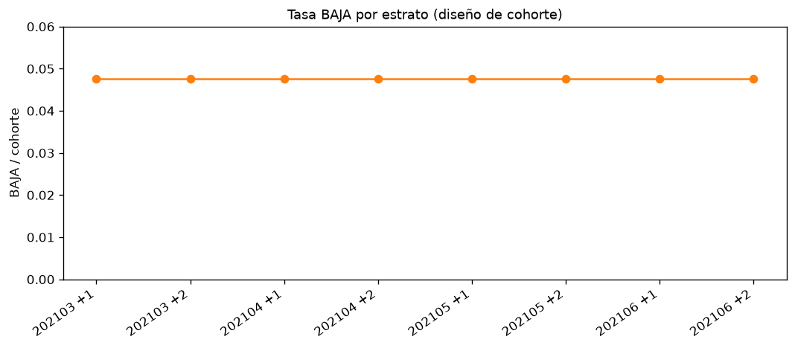
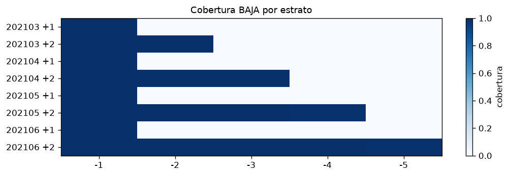
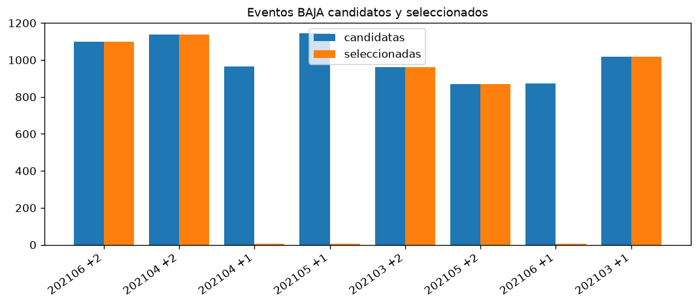
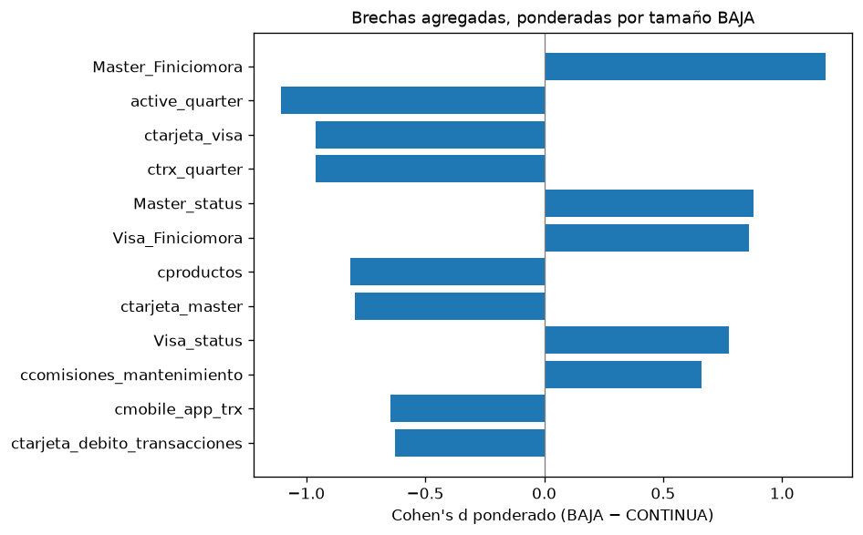
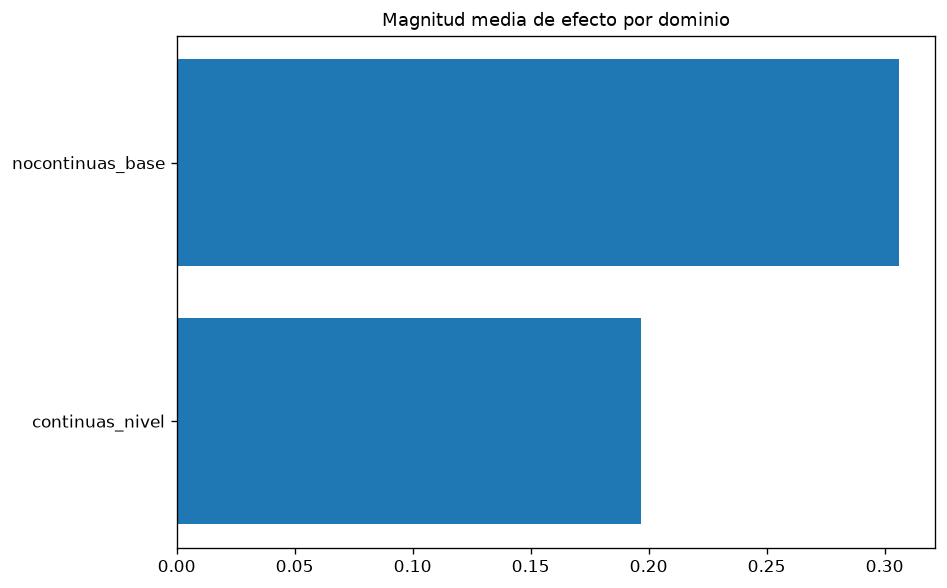
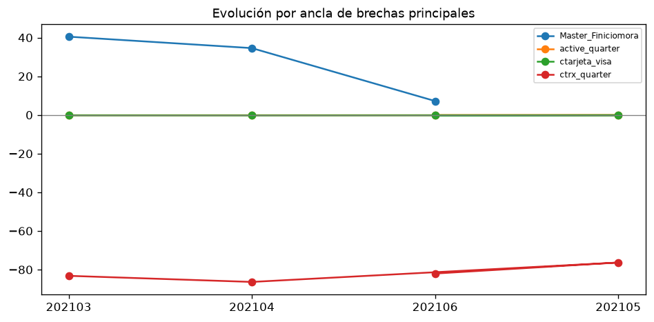
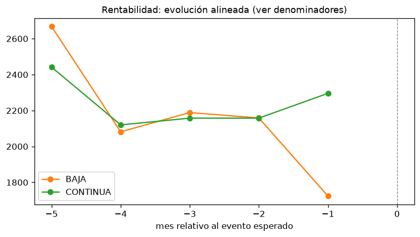
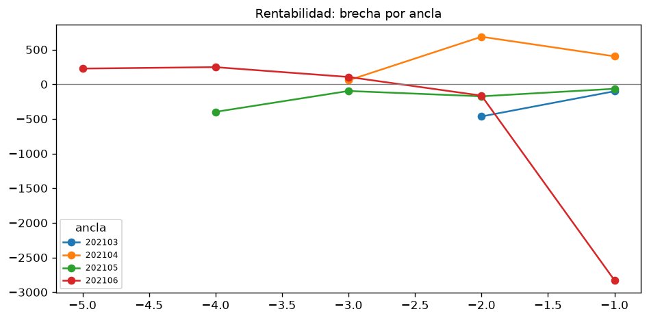
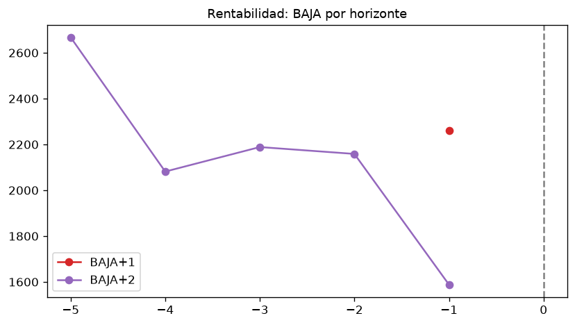
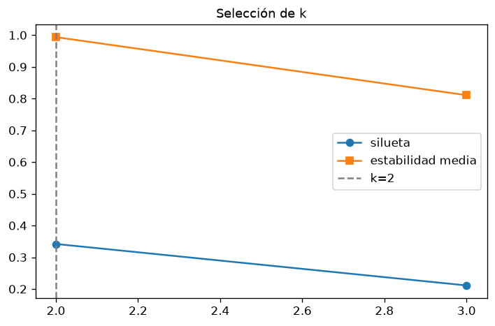
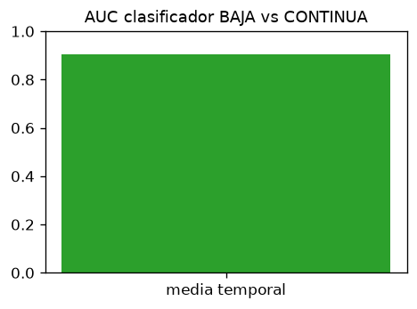
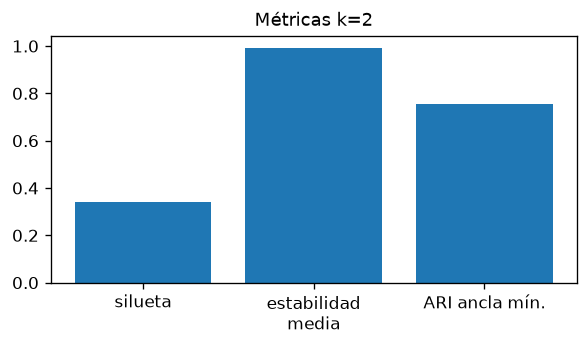

Rutas y criterio de selección: `destacados.md`. Tablas fuente: `tablas/`.
