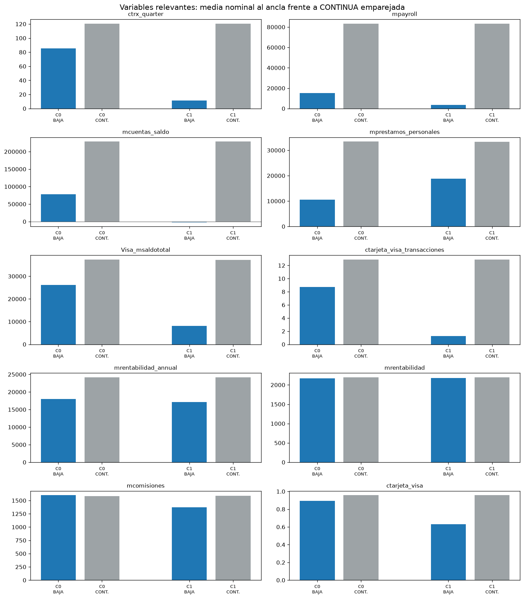
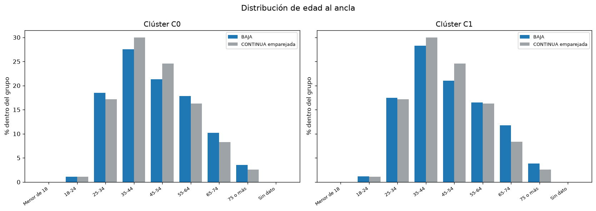
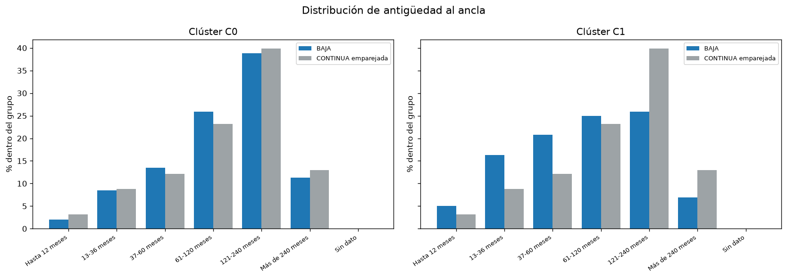
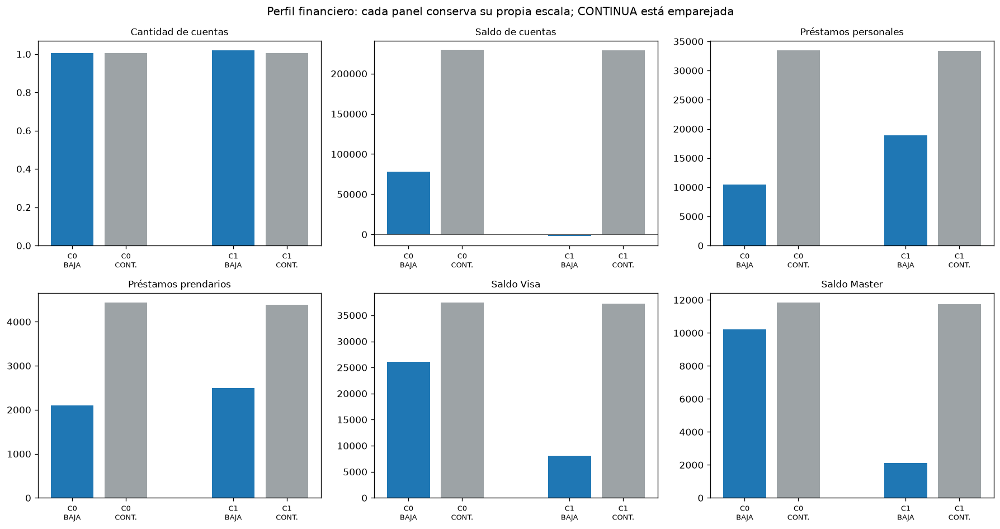

# Perfiles de clientes por clúster

Este informe es descriptivo. Las diferencias al ancla se contrastan contra CONTINUA emparejada por `(foto_mes_ancla, horizonte_evento)` con los mismos pesos estratificados usados por el pipeline; no prueban causalidad.

Semántica de BAJA: un cliente rotulado BAJA+1 en la foto `t` deja de estar en la base en `t+1`; para BAJA+2 deja de estar en `t+2`. En este informe `mes_relativo=0` es esa primera foto sin registro, no una observación. BAJA+1 se ancla en `t=-1` y BAJA+2 en `t=-2`; las trayectorias BAJA usan exclusivamente `t<0`.

## Marco del informe ejecutivo

El informe ejecutivo analiza **5098 episodios BAJA** y **101960 episodios CONTINUA** en **8 estratos ancla–horizonte**. CONTINUA es una referencia seleccionada determinísticamente por estrato, no un contrafactual causal.
En el conjunto total, **112 variables** cumplen el criterio de persistencia: misma dirección con IC95% fuera de cero en al menos 75 % de las anclas y tres o más anclas.
Efecto medio absoluto por dominio en la cohorte completa (lectura agregada, no causal):
| dominio | n_vars | mean_abs_cohens_d | max_abs_cohens_d |
| --- | --- | --- | --- |
| nocontinuas_base | 28 | 0.306 | 1.108 |
| continuas_nivel | 126 | 0.197 | 1.181 |
Los perfiles y el histórico C1 que siguen son un desglose de ese marco global; no sustituyen sus controles estratificados ni convierten las asociaciones en causas.

## Alcance

Se describen 5098 episodios BAJA en **2 clústeres aceptados**. AUC temporal media/mínima: **0.906 / 0.892**; silueta elegida: **0.342**.
No hay patrimonio neto ni deuda total consolidada en la fuente. Los saldos, préstamos y tarjetas son proxies operativos y no permiten afirmaciones absolutas sobre riqueza, endeudamiento total o capacidad de pago.

## Tamaño de los clústeres

| cluster | n | peso | BAJA+1 | BAJA+2 |
| --- | --- | --- | --- | --- |
| 0 | 1836 | 0.360 | 349 | 1487 |
| 1 | 3262 | 0.640 | 682 | 2580 |

## Síntesis comparativa

- C0: **1836 episodios (36 %)**; 85.2 transacciones trimestrales frente a 120.5 en CONTINUA; saldo de cuentas 78.157 frente a 229.415.
- C1: **3262 episodios (64 %)**; 11.5 transacciones trimestrales frente a 120.6 en CONTINUA; saldo de cuentas -2.290 frente a 228.729.
El detalle siguiente cubre payroll, cuentas, préstamos, tarjetas, edad y antigüedad, con sus brechas frente a CONTINUA emparejada.

## Clúster C0

C0 reúne **1836 episodios BAJA** (0.360 del total BAJA). Se observan sus niveles al ancla y sus brechas descriptivas frente a CONTINUA emparejada.

**Demografía.** Edad (años): BAJA **47.6**, CONTINUA emparejada **46.8**, brecha BAJA−CONTINUA **0.806**. Antigüedad (meses): BAJA **130.2**, CONTINUA emparejada **134.9**, brecha BAJA−CONTINUA **-4.737**.

**Uso transaccional.** Transacciones trimestrales: BAJA **85.2**, CONTINUA emparejada **120.5**, brecha BAJA−CONTINUA **-35.4**. Transacciones Visa: BAJA **8.701**, CONTINUA emparejada **12.9**, brecha BAJA−CONTINUA **-4.217**. Transacciones Master: BAJA **1.485**, CONTINUA emparejada **2.389**, brecha BAJA−CONTINUA **-0.904**.

**Payroll y cuentas.** Payroll: BAJA **15.163**, CONTINUA emparejada **83.370**, brecha BAJA−CONTINUA **-68.208**. Cantidad de cuentas: BAJA **1.004**, CONTINUA emparejada **1.005**, brecha BAJA−CONTINUA **-0.001**. Saldo de cuentas: BAJA **78.157**, CONTINUA emparejada **229.415**, brecha BAJA−CONTINUA **-151.257**.

**Préstamos y tarjetas.** Préstamos personales: BAJA **10.482**, CONTINUA emparejada **33.447**, brecha BAJA−CONTINUA **-22.965**. Préstamos prendarios: BAJA **2.097**, CONTINUA emparejada **4.431**, brecha BAJA−CONTINUA **-2.335**. Saldo Visa: BAJA **26.132**, CONTINUA emparejada **37.404**, brecha BAJA−CONTINUA **-11.272**. Saldo Master: BAJA **10.213**, CONTINUA emparejada **11.828**, brecha BAJA−CONTINUA **-1.616**.

### Finanzas operativas

`deuda_total_operativa = mprestamos_personales + mprestamos_prendarios + mprestamos_hipotecarios + max(Visa_msaldototal, 0) + max(Master_msaldototal, 0)`; `patrimonio_liquido_operativo = mcuentas_saldo − deuda_total_operativa`. Los nulos de las variables fuente se tratan como cero.
| métrica | n BAJA | BAJA media | BAJA mediana | n CONTINUA emparejada | CONTINUA media | CONTINUA mediana | brecha media BAJA−CONTINUA | brecha mediana BAJA−CONTINUA |
| --- | --- | --- | --- | --- | --- | --- | --- | --- |
| Deuda total operativa | 1836 | 50.106 | 13.274 | 101960 | 109.490 | 33.287 | -59.384 | -20.013 |
| Patrimonio líquido operativo | 1836 | 28.051 | -2.358 | 101960 | 119.659 | 1.149 | -91.608 | -3.508 |
Limitación: `patrimonio_liquido_operativo` no es patrimonio neto. Excluye `mactivos_margen` y `mpasivos_margen`, además de activos, pasivos y obligaciones que no estén representados en esta fórmula.

### Perfil nominal completo al ancla

Las filas siguientes usan los valores nominales de las columnas fuente; no muestran percentiles, `percent_rnk` ni puntuaciones SHAP. La diferencia porcentual se calcula como `(media BAJA − media CONTINUA) / abs(media CONTINUA) × 100`; queda sin definir si la media CONTINUA es cero.
| dominio | métrica | n BAJA | BAJA media nominal | BAJA mediana nominal | CONTINUA media nominal | CONTINUA mediana nominal | brecha nominal BAJA−CONTINUA | diferencia porcentual vs CONTINUA |
| --- | --- | --- | --- | --- | --- | --- | --- | --- |
| canales | Transacciones Master | 1836 | 1.485 | 0.000 | 2.395 | 0.000 | -0.910 | -38.0 |
| canales | Transacciones Visa | 1836 | 8.701 | 5.000 | 12.9 | 9.000 | -4.242 | -32.8 |
| canales | Transacciones trimestrales | 1836 | 85.2 | 66.0 | 120.5 | 106.0 | -35.4 | -29.3 |
| canales | internet | 1836 | 0.070 | 0.000 | 0.053 | 0.000 | 0.017 | 32.2 |
| canales | thomebanking | 1836 | 0.768 | 1.000 | 0.742 | 1.000 | 0.026 | 3.496 |
| canales | tmobile_app | 1836 | 0.053 | 0.000 | 0.031 | 0.000 | 0.022 | 71.8 |
| finanzas_operativas | Deuda total operativa | 1836 | 50.106 | 13.274 | 109.490 | 33.287 | -59.384 | -54.2 |
| finanzas_operativas | Patrimonio líquido operativo | 1836 | 28.051 | -2.358 | 119.659 | 1.149 | -91.608 | -76.6 |
| otros_indicadores | Actividad trimestral | 1836 | 1.000 | 1.000 | 0.990 | 1.000 | 0.010 | 1.050 |
| otros_indicadores | Cliente VIP | 1836 | 0.001 | 0.000 | 0.004 | 0.000 | -0.003 | -84.4 |
| otros_indicadores | Descubierto preacordado | 1836 | 0.925 | 1.000 | 0.967 | 1.000 | -0.041 | -4.282 |
| otros_indicadores | Seguro automotor | 1836 | 0.026 | 0.000 | 0.034 | 0.000 | -0.008 | -22.9 |
| otros_indicadores | Seguro de vida | 1836 | 0.066 | 0.000 | 0.117 | 0.000 | -0.051 | -43.8 |
| perfil_cliente | Antigüedad (meses) | 1836 | 130.2 | 121.0 | 134.9 | 128.0 | -4.757 | -3.525 |
| perfil_cliente | Cantidad de cuentas | 1836 | 1.004 | 1.000 | 1.005 | 1.000 | -0.001 | -0.069 |
| perfil_cliente | Edad (años) | 1836 | 47.6 | 46.0 | 46.8 | 45.0 | 0.799 | 1.707 |
| perfil_cliente | Payroll | 1836 | 15.163 | 0.000 | 83.818 | 38.474 | -68.656 | -81.9 |
| productos | Préstamos personales | 1836 | 10.482 | 0.000 | 33.475 | 0.000 | -22.993 | -68.7 |
| productos | Préstamos prendarios | 1836 | 2.097 | 0.000 | 4.453 | 0.000 | -2.356 | -52.9 |
| productos | ccuenta_corriente | 1836 | 1.002 | 1.000 | 1.002 | 1.000 | -0.001 | -0.084 |
| productos | cproductos | 1836 | 6.960 | 7.000 | 7.566 | 7.000 | -0.606 | -8.005 |
| productos | ctarjeta_debito | 1836 | 1.464 | 1.000 | 1.482 | 1.000 | -0.018 | -1.232 |
| productos | ctarjeta_master | 1836 | 0.816 | 1.000 | 0.900 | 1.000 | -0.084 | -9.298 |
| productos | ctarjeta_visa | 1836 | 0.895 | 1.000 | 0.957 | 1.000 | -0.062 | -6.500 |
| rentabilidad | mcomisiones | 1836 | 1.599 | 1.592 | 1.576 | 932.0 | 23.3 | 1.477 |
| rentabilidad | mrentabilidad | 1836 | 2.173 | 1.496 | 2.188 | 1.231 | -14.6 | -0.669 |
| rentabilidad | mrentabilidad_annual | 1836 | 18.045 | 8.713 | 24.167 | 13.050 | -6.122 | -25.3 |
| saldos | Saldo Master | 1542 | 10.213 | 0.000 | 11.821 | 0.000 | -1.608 | -13.6 |
| saldos | Saldo Visa | 1678 | 26.132 | 11.117 | 37.439 | 20.494 | -11.307 | -30.2 |
| saldos | Saldo de cuentas | 1836 | 78.157 | 6.181 | 229.149 | 38.836 | -150.992 | -65.9 |

## Clúster C1

C1 reúne **3262 episodios BAJA** (0.640 del total BAJA). Se observan sus niveles al ancla y sus brechas descriptivas frente a CONTINUA emparejada.

**Demografía.** Edad (años): BAJA **47.9**, CONTINUA emparejada **46.8**, brecha BAJA−CONTINUA **1.099**. Antigüedad (meses): BAJA **99.2**, CONTINUA emparejada **134.9**, brecha BAJA−CONTINUA **-35.7**.

**Uso transaccional.** Transacciones trimestrales: BAJA **11.5**, CONTINUA emparejada **120.6**, brecha BAJA−CONTINUA **-109.1**. Transacciones Visa: BAJA **1.247**, CONTINUA emparejada **12.9**, brecha BAJA−CONTINUA **-11.7**. Transacciones Master: BAJA **0.118**, CONTINUA emparejada **2.383**, brecha BAJA−CONTINUA **-2.265**.

**Payroll y cuentas.** Payroll: BAJA **3.422**, CONTINUA emparejada **83.135**, brecha BAJA−CONTINUA **-79.713**. Cantidad de cuentas: BAJA **1.019**, CONTINUA emparejada **1.005**, brecha BAJA−CONTINUA **0.014**. Saldo de cuentas: BAJA **-2.290**, CONTINUA emparejada **228.729**, brecha BAJA−CONTINUA **-231.019**.

**Préstamos y tarjetas.** Préstamos personales: BAJA **18.851**, CONTINUA emparejada **33.373**, brecha BAJA−CONTINUA **-14.522**. Préstamos prendarios: BAJA **2.500**, CONTINUA emparejada **4.388**, brecha BAJA−CONTINUA **-1.888**. Saldo Visa: BAJA **8.081**, CONTINUA emparejada **37.225**, brecha BAJA−CONTINUA **-29.144**. Saldo Master: BAJA **2.117**, CONTINUA emparejada **11.728**, brecha BAJA−CONTINUA **-9.611**.

### Finanzas operativas

`deuda_total_operativa = mprestamos_personales + mprestamos_prendarios + mprestamos_hipotecarios + max(Visa_msaldototal, 0) + max(Master_msaldototal, 0)`; `patrimonio_liquido_operativo = mcuentas_saldo − deuda_total_operativa`. Los nulos de las variables fuente se tratan como cero.
| métrica | n BAJA | BAJA media | BAJA mediana | n CONTINUA emparejada | CONTINUA media | CONTINUA mediana | brecha media BAJA−CONTINUA | brecha mediana BAJA−CONTINUA |
| --- | --- | --- | --- | --- | --- | --- | --- | --- |
| Deuda total operativa | 3262 | 28.551 | 0.000 | 101960 | 108.956 | 33.142 | -80.405 | -33.142 |
| Patrimonio líquido operativo | 3262 | -30.841 | -8.321 | 101960 | 119.258 | 1.159 | -150.099 | -9.480 |
Limitación: `patrimonio_liquido_operativo` no es patrimonio neto. Excluye `mactivos_margen` y `mpasivos_margen`, además de activos, pasivos y obligaciones que no estén representados en esta fórmula.

### Perfil nominal completo al ancla

Las filas siguientes usan los valores nominales de las columnas fuente; no muestran percentiles, `percent_rnk` ni puntuaciones SHAP. La diferencia porcentual se calcula como `(media BAJA − media CONTINUA) / abs(media CONTINUA) × 100`; queda sin definir si la media CONTINUA es cero.
| dominio | métrica | n BAJA | BAJA media nominal | BAJA mediana nominal | CONTINUA media nominal | CONTINUA mediana nominal | brecha nominal BAJA−CONTINUA | diferencia porcentual vs CONTINUA |
| --- | --- | --- | --- | --- | --- | --- | --- | --- |
| canales | Transacciones Master | 3262 | 0.118 | 0.000 | 2.389 | 0.000 | -2.271 | -95.0 |
| canales | Transacciones Visa | 3262 | 1.247 | 0.000 | 12.9 | 9.000 | -11.7 | -90.4 |
| canales | Transacciones trimestrales | 3262 | 11.5 | 9.000 | 120.5 | 106.0 | -109.1 | -90.5 |
| canales | internet | 3262 | 0.245 | 0.000 | 0.053 | 0.000 | 0.192 | 363.8 |
| canales | thomebanking | 3262 | 0.384 | 0.000 | 0.743 | 1.000 | -0.359 | -48.4 |
| canales | tmobile_app | 3262 | 0.012 | 0.000 | 0.031 | 0.000 | -0.020 | -62.6 |
| finanzas_operativas | Deuda total operativa | 3262 | 28.551 | 0.000 | 108.956 | 33.142 | -80.405 | -73.8 |
| finanzas_operativas | Patrimonio líquido operativo | 3262 | -30.841 | -8.321 | 119.258 | 1.159 | -150.099 | -125.9 |
| otros_indicadores | Actividad trimestral | 3262 | 0.764 | 1.000 | 0.990 | 1.000 | -0.225 | -22.8 |
| otros_indicadores | Cliente VIP | 3262 | 0.001 | 0.000 | 0.003 | 0.000 | -0.003 | -82.3 |
| otros_indicadores | Descubierto preacordado | 3262 | 0.817 | 1.000 | 0.967 | 1.000 | -0.150 | -15.5 |
| otros_indicadores | Seguro automotor | 3262 | 0.011 | 0.000 | 0.034 | 0.000 | -0.023 | -68.2 |
| otros_indicadores | Seguro de vida | 3262 | 0.040 | 0.000 | 0.117 | 0.000 | -0.077 | -65.5 |
| perfil_cliente | Antigüedad (meses) | 3262 | 99.2 | 72.0 | 135.0 | 128.0 | -35.7 | -26.5 |
| perfil_cliente | Cantidad de cuentas | 3262 | 1.019 | 1.000 | 1.005 | 1.000 | 0.014 | 1.388 |
| perfil_cliente | Edad (años) | 3262 | 47.9 | 46.0 | 46.8 | 45.0 | 1.094 | 2.335 |
| perfil_cliente | Payroll | 3262 | 3.422 | 0.000 | 83.405 | 37.930 | -79.983 | -95.9 |
| productos | Préstamos personales | 3262 | 18.851 | 0.000 | 33.393 | 0.000 | -14.542 | -43.5 |
| productos | Préstamos prendarios | 3262 | 2.500 | 0.000 | 4.407 | 0.000 | -1.907 | -43.3 |
| productos | ccuenta_corriente | 3262 | 1.000 | 1.000 | 1.002 | 1.000 | -0.002 | -0.249 |
| productos | cproductos | 3262 | 6.013 | 6.000 | 7.567 | 7.000 | -1.553 | -20.5 |
| productos | ctarjeta_debito | 3262 | 1.433 | 1.000 | 1.482 | 1.000 | -0.050 | -3.369 |
| productos | ctarjeta_master | 3262 | 0.559 | 1.000 | 0.900 | 1.000 | -0.341 | -37.9 |
| productos | ctarjeta_visa | 3262 | 0.632 | 1.000 | 0.957 | 1.000 | -0.325 | -33.9 |
| rentabilidad | mcomisiones | 3262 | 1.373 | 1.592 | 1.581 | 932.4 | -208.0 | -13.2 |
| rentabilidad | mrentabilidad | 3262 | 2.182 | 1.797 | 2.190 | 1.228 | -7.346 | -0.336 |
| rentabilidad | mrentabilidad_annual | 3262 | 17.136 | 9.737 | 24.164 | 13.056 | -7.028 | -29.1 |
| saldos | Saldo Master | 1992 | 2.117 | 0.000 | 11.717 | 0.000 | -9.601 | -81.9 |
| saldos | Saldo Visa | 2219 | 8.081 | 0.000 | 37.252 | 20.398 | -29.171 | -78.3 |
| saldos | Saldo de cuentas | 3262 | -2.290 | -3.175 | 228.214 | 38.742 | -230.504 | -101.0 |

## Ciclo de vida de los perfiles antes de BAJA

Cada foto previa al evento se puntuó con el mismo LightGBM y KMeans ajustados al ancla. La asignación al ancla reproduce la segmentación publicada; por ello los cambios siguientes son cambios de estado del modelo, no nuevos clústeres.
- Estratos con soporte: **4 de 8**; pares calendario consecutivos incluidos: **10208**.
- Entre **4067** episodios con al menos dos fotos previas, **12.8%** cambia entre el primer estado observable y `t=-1`.
- Para **3096** episodios con historia anterior a `t=-2`, el cambio primer estado→`t=-2` es **10.3%**; primer estado→`t=-1`, **14.6%**; y `t=-2`→`t=-1`, **7.6%**.

Matriz entre el primer estado observable y `t=-1`:
| estado_inicial_observable | estado_menos_1 | n_episodios | n_episodios_origen | probabilidad |
| --- | --- | --- | --- | --- |
| 0 | 0 | 1291 | 1693 | 0.763 |
| 0 | 1 | 402 | 1693 | 0.237 |
| 1 | 0 | 120 | 2374 | 0.051 |
| 1 | 1 | 2254 | 2374 | 0.949 |

Matriz agregada de transiciones entre meses calendario consecutivos:
| estado_origen | estado_destino | n_pares | n_pares_origen | n_estratos_contributivos | probabilidad |
| --- | --- | --- | --- | --- | --- |
| 0 | 0 | 3690 | 4201 | 4 | 0.878 |
| 0 | 1 | 511 | 4201 | 4 | 0.122 |
| 1 | 0 | 229 | 6007 | 4 | 0.038 |
| 1 | 1 | 5778 | 6007 | 4 | 0.962 |

Los estratos con soporte insuficiente no se mezclan en las matrices. Por definición de BAJA, no hay trayectoria publicable desde `t=0`: la ausencia del cliente no se interpreta como continuidad ni como saldo cero. Tampoco se demuestra causalidad, migración estructural o efecto de una intervención.

## Saldo previo de los episodios que terminan en C0

Aquí «terminan en C0» significa que el mismo modelo asigna C0 en `t=-1`, la última foto observable antes de que el cliente desaparezca. No equivale necesariamente a C0 al ancla: para BAJA+2 el ancla ocurre en `t=-2`.
La tabla reconstruye sólo fotos previas (`t<0`) y pondera CONTINUA por `(foto_mes_ancla, horizonte_evento)` de esos episodios.
| meses antes de la desaparición | episodios C0 observados | saldo medio C0 terminal | saldo mediano C0 terminal | saldo medio CONTINUA ponderada | brecha media C0−CONTINUA |
| --- | --- | --- | --- | --- | --- |
| -5 | 380 | 111.884 | 20.533 | 231.600 | -119.716 |
| -4 | 719 | 121.790 | 14.828 | 221.928 | -100.138 |
| -3 | 1087 | 100.786 | 9.098 | 219.960 | -119.174 |
| -2 | 1411 | 96.173 | 8.024 | 231.750 | -135.577 |
| -1 | 1760 | 79.755 | 2.953 | 238.347 | -158.592 |
En la media de las fotos disponibles, el saldo de estos episodios pasa de **111.884** en `t=-5` a **79.755** en `t=-1`. En todos los meses observables, el saldo medio de C0 terminal quedó por debajo de la referencia CONTINUA ponderada por los mismos estratos.
La variación entre filas no identifica el cambio de cada cliente: el número de episodios observados cambia con el mes relativo. Por ello permite descartar o sustentar un patrón de niveles previos, no atribuir causalidad ni medir el saldo después de la baja.

## Histórico completo de variables relevantes: C0 terminal

Se publican las **30 variables**: las 28 admitidas por el clasificador y los dos proxies financieros operativos. Cada fila se refiere a los episodios cuyo último estado observable es C0 y sólo contiene fotos anteriores a la desaparición.
Los niveles son medias; las brechas restan la media CONTINUA ponderada por los mismos estratos. Los denominadores por variable y mes están en `tablas/cluster_ciclo_vida_c0_terminal_historico.csv`.

### Canales y transacciones

Niveles medios de C0 terminal:
| métrica | t=-5 | t=-4 | t=-3 | t=-2 | t=-1 |
| --- | --- | --- | --- | --- | --- |
| Transacciones Master | 1.650 | 1.773 | 1.609 | 1.547 | 1.340 |
| Transacciones Visa | 10.4 | 9.858 | 9.103 | 8.867 | 8.184 |
| Transacciones trimestrales | 94.0 | 93.0 | 88.6 | 86.8 | 81.7 |
| internet | 0.058 | 0.045 | 0.055 | 0.058 | 0.065 |
| thomebanking | 0.734 | 0.786 | 0.764 | 0.763 | 0.814 |
| tmobile_app | 0.024 | 0.029 | 0.044 | 0.049 | 0.084 |
Brecha media C0 terminal − CONTINUA ponderada:
| métrica | t=-5 | t=-4 | t=-3 | t=-2 | t=-1 |
| --- | --- | --- | --- | --- | --- |
| Transacciones Master | -0.596 | -0.551 | -0.728 | -0.882 | -1.082 |
| Transacciones Visa | -2.089 | -2.784 | -3.546 | -4.108 | -4.768 |
| Transacciones trimestrales | -25.7 | -27.2 | -31.5 | -33.8 | -39.6 |
| internet | 0.008 | -0.009 | 0.001 | 0.004 | 0.017 |
| thomebanking | -0.023 | 0.038 | 0.021 | 0.023 | 0.076 |
| tmobile_app | -0.007 | -0.003 | 0.014 | 0.019 | 0.056 |

### Finanzas operativas

Niveles medios de C0 terminal:
| métrica | t=-5 | t=-4 | t=-3 | t=-2 | t=-1 |
| --- | --- | --- | --- | --- | --- |
| Deuda total operativa | 58.617 | 52.332 | 53.523 | 46.446 | 47.215 |
| Patrimonio líquido operativo | 53.267 | 69.458 | 47.263 | 49.727 | 32.540 |
Brecha media C0 terminal − CONTINUA ponderada:
| métrica | t=-5 | t=-4 | t=-3 | t=-2 | t=-1 |
| --- | --- | --- | --- | --- | --- |
| Deuda total operativa | -43.763 | -53.701 | -53.624 | -64.650 | -64.907 |
| Patrimonio líquido operativo | -75.953 | -46.437 | -65.551 | -70.927 | -93.684 |

### Otros indicadores del clasificador

Niveles medios de C0 terminal:
| métrica | t=-5 | t=-4 | t=-3 | t=-2 | t=-1 |
| --- | --- | --- | --- | --- | --- |
| Actividad trimestral | 0.997 | 0.997 | 1.000 | 1.000 | 1.000 |
| Descubierto preacordado | 0.937 | 0.937 | 0.937 | 0.931 | 0.889 |
| Cliente VIP | 0.000 | 0.000 | 0.001 | 0.001 | 0.001 |
| Seguro automotor | 0.045 | 0.024 | 0.028 | 0.026 | 0.022 |
| Seguro de vida | 0.105 | 0.088 | 0.075 | 0.072 | 0.056 |
Brecha media C0 terminal − CONTINUA ponderada:
| métrica | t=-5 | t=-4 | t=-3 | t=-2 | t=-1 |
| --- | --- | --- | --- | --- | --- |
| Actividad trimestral | 0.006 | 0.006 | 0.010 | 0.011 | 0.010 |
| Descubierto preacordado | -0.030 | -0.030 | -0.029 | -0.035 | -0.076 |
| Cliente VIP | -0.002 | -0.003 | -0.002 | -0.003 | -0.002 |
| Seguro automotor | 0.012 | -0.010 | -0.006 | -0.008 | -0.013 |
| Seguro de vida | -0.010 | -0.030 | -0.041 | -0.045 | -0.061 |

### Perfil del cliente

Niveles medios de C0 terminal:
| métrica | t=-5 | t=-4 | t=-3 | t=-2 | t=-1 |
| --- | --- | --- | --- | --- | --- |
| Antigüedad (meses) | 124.0 | 128.9 | 129.1 | 129.1 | 130.4 |
| Edad (años) | 46.3 | 46.9 | 47.0 | 47.0 | 47.4 |
| Payroll | 23.745 | 38.047 | 30.120 | 20.722 | 15.237 |
| Cantidad de cuentas | 1.000 | 1.003 | 1.006 | 1.004 | 1.005 |
Brecha media C0 terminal − CONTINUA ponderada:
| métrica | t=-5 | t=-4 | t=-3 | t=-2 | t=-1 |
| --- | --- | --- | --- | --- | --- |
| Antigüedad (meses) | -10.5 | -5.272 | -5.511 | -5.745 | -5.345 |
| Edad (años) | -0.559 | 0.066 | 0.107 | 0.149 | 0.476 |
| Payroll | -49.911 | -37.967 | -45.052 | -63.580 | -67.795 |
| Cantidad de cuentas | -0.005 | -0.002 | 0.000 | -0.001 | 0.001 |

### Productos

Niveles medios de C0 terminal:
| métrica | t=-5 | t=-4 | t=-3 | t=-2 | t=-1 |
| --- | --- | --- | --- | --- | --- |
| ccuenta_corriente | 1.000 | 1.000 | 1.002 | 1.001 | 1.001 |
| cproductos | 7.258 | 7.227 | 7.119 | 7.028 | 6.787 |
| ctarjeta_debito | 1.455 | 1.473 | 1.473 | 1.454 | 1.453 |
| ctarjeta_master | 0.868 | 0.865 | 0.848 | 0.828 | 0.775 |
| ctarjeta_visa | 0.918 | 0.928 | 0.916 | 0.904 | 0.849 |
| Préstamos personales | 20.844 | 15.578 | 11.735 | 10.721 | 7.845 |
| Préstamos prendarios | 3.753 | 3.769 | 2.935 | 3.054 | 1.657 |
Brecha media C0 terminal − CONTINUA ponderada:
| métrica | t=-5 | t=-4 | t=-3 | t=-2 | t=-1 |
| --- | --- | --- | --- | --- | --- |
| ccuenta_corriente | -0.003 | -0.002 | -0.001 | -0.001 | -0.001 |
| cproductos | -0.301 | -0.340 | -0.445 | -0.535 | -0.781 |
| ctarjeta_debito | -0.025 | -0.010 | -0.011 | -0.027 | -0.025 |
| ctarjeta_master | -0.030 | -0.034 | -0.050 | -0.071 | -0.124 |
| ctarjeta_visa | -0.040 | -0.030 | -0.041 | -0.052 | -0.106 |
| Préstamos personales | -11.594 | -17.023 | -21.261 | -23.309 | -25.950 |
| Préstamos prendarios | -1.527 | -931.1 | -1.484 | -1.587 | -2.985 |

### Rentabilidad

Niveles medios de C0 terminal:
| métrica | t=-5 | t=-4 | t=-3 | t=-2 | t=-1 |
| --- | --- | --- | --- | --- | --- |
| mcomisiones | 1.587 | 1.353 | 1.249 | 1.525 | 1.701 |
| mrentabilidad | 2.363 | 1.771 | 1.905 | 2.296 | 2.176 |
| mrentabilidad_annual | 16.868 | 18.097 | 18.571 | 18.484 | 18.849 |
Brecha media C0 terminal − CONTINUA ponderada:
| métrica | t=-5 | t=-4 | t=-3 | t=-2 | t=-1 |
| --- | --- | --- | --- | --- | --- |
| mcomisiones | -181.9 | -227.8 | -321.0 | -13.5 | 106.7 |
| mrentabilidad | -78.4 | -362.7 | -234.9 | 138.9 | -127.2 |
| mrentabilidad_annual | -6.837 | -5.594 | -5.323 | -5.693 | -5.711 |

### Saldos

Niveles medios de C0 terminal:
| métrica | t=-5 | t=-4 | t=-3 | t=-2 | t=-1 |
| --- | --- | --- | --- | --- | --- |
| Saldo Master | 8.679 | 9.939 | 9.131 | 9.871 | 10.251 |
| Saldo Visa | 27.757 | 25.311 | 25.712 | 25.703 | 25.968 |
| Saldo de cuentas | 111.884 | 121.790 | 100.786 | 96.173 | 79.755 |
Brecha media C0 terminal − CONTINUA ponderada:
| métrica | t=-5 | t=-4 | t=-3 | t=-2 | t=-1 |
| --- | --- | --- | --- | --- | --- |
| Saldo Master | -2.020 | -1.139 | -2.430 | -2.264 | -2.134 |
| Saldo Visa | -7.573 | -10.306 | -10.601 | -12.239 | -12.506 |
| Saldo de cuentas | -119.716 | -100.138 | -119.174 | -135.577 | -158.592 |
Estas medias históricas no son trayectorias individuales: cambian los episodios observables y no se estima un efecto causal de ninguna variable.

## Saldo previo de los episodios que terminan en C1

Aquí «terminan en C1» significa que el mismo modelo asigna C1 en `t=-1`, la última foto observable antes de que el cliente desaparezca. No equivale necesariamente a C1 al ancla: para BAJA+2 el ancla ocurre en `t=-2`.
La tabla reconstruye sólo fotos previas (`t<0`) y pondera CONTINUA por `(foto_mes_ancla, horizonte_evento)` de esos episodios.
| meses antes de la desaparición | episodios C1 observados | saldo medio C1 terminal | saldo mediano C1 terminal | saldo medio CONTINUA ponderada | brecha media C1−CONTINUA |
| --- | --- | --- | --- | --- | --- |
| -5 | 708 | 3.251 | -1.085 | 231.600 | -228.348 |
| -4 | 1238 | 2.536 | -1.706 | 222.090 | -219.554 |
| -3 | 2009 | 105.5 | -2.636 | 219.723 | -219.617 |
| -2 | 2656 | -3.090 | -3.149 | 231.362 | -234.451 |
| -1 | 3338 | -8.171 | -3.271 | 237.243 | -245.414 |
En la media de las fotos disponibles, el saldo de estos episodios pasa de **3.251** en `t=-5` a **-8.171** en `t=-1`. En todos los meses observables, el saldo medio de C1 terminal quedó por debajo de la referencia CONTINUA ponderada por los mismos estratos.
La variación entre filas no identifica el cambio de cada cliente: el número de episodios observados cambia con el mes relativo. Por ello permite descartar o sustentar un patrón de niveles previos, no atribuir causalidad ni medir el saldo después de la baja.

## Histórico completo de variables relevantes: C1 terminal

Se publican las **30 variables**: las 28 admitidas por el clasificador y los dos proxies financieros operativos. Cada fila se refiere a los episodios cuyo último estado observable es C1 y sólo contiene fotos anteriores a la desaparición.
Los niveles son medias; las brechas restan la media CONTINUA ponderada por los mismos estratos. Los denominadores por variable y mes están en `tablas/cluster_ciclo_vida_c1_terminal_historico.csv`.

### Canales y transacciones

Niveles medios de C1 terminal:
| métrica | t=-5 | t=-4 | t=-3 | t=-2 | t=-1 |
| --- | --- | --- | --- | --- | --- |
| Transacciones Master | 0.350 | 0.334 | 0.205 | 0.155 | 0.087 |
| Transacciones Visa | 2.329 | 2.185 | 1.594 | 1.370 | 1.082 |
| Transacciones trimestrales | 22.8 | 20.3 | 15.4 | 12.8 | 11.3 |
| internet | 0.306 | 0.358 | 0.324 | 0.278 | 0.166 |
| thomebanking | 0.404 | 0.402 | 0.378 | 0.377 | 0.451 |
| tmobile_app | 0.007 | 0.015 | 0.013 | 0.012 | 0.016 |
Brecha media C1 terminal − CONTINUA ponderada:
| métrica | t=-5 | t=-4 | t=-3 | t=-2 | t=-1 |
| --- | --- | --- | --- | --- | --- |
| Transacciones Master | -1.896 | -1.994 | -2.125 | -2.275 | -2.321 |
| Transacciones Visa | -10.2 | -10.5 | -11.0 | -11.6 | -11.8 |
| Transacciones trimestrales | -96.9 | -100.0 | -104.7 | -107.8 | -110.0 |
| internet | 0.257 | 0.303 | 0.270 | 0.224 | 0.117 |
| thomebanking | -0.353 | -0.345 | -0.366 | -0.363 | -0.288 |
| tmobile_app | -0.024 | -0.017 | -0.017 | -0.019 | -0.012 |

### Finanzas operativas

Niveles medios de C1 terminal:
| métrica | t=-5 | t=-4 | t=-3 | t=-2 | t=-1 |
| --- | --- | --- | --- | --- | --- |
| Deuda total operativa | 81.026 | 63.627 | 42.464 | 34.859 | 22.909 |
| Patrimonio líquido operativo | -77.774 | -61.090 | -42.359 | -37.948 | -31.080 |
Brecha media C1 terminal − CONTINUA ponderada:
| métrica | t=-5 | t=-4 | t=-3 | t=-2 | t=-1 |
| --- | --- | --- | --- | --- | --- |
| Deuda total operativa | -21.354 | -42.342 | -64.305 | -75.865 | -88.779 |
| Patrimonio líquido operativo | -206.994 | -177.212 | -155.312 | -158.586 | -156.635 |

### Otros indicadores del clasificador

Niveles medios de C1 terminal:
| métrica | t=-5 | t=-4 | t=-3 | t=-2 | t=-1 |
| --- | --- | --- | --- | --- | --- |
| Actividad trimestral | 0.860 | 0.840 | 0.805 | 0.785 | 0.764 |
| Descubierto preacordado | 0.815 | 0.843 | 0.848 | 0.834 | 0.744 |
| Cliente VIP | 0.000 | 0.001 | 0.000 | 0.001 | 0.001 |
| Seguro automotor | 0.007 | 0.016 | 0.014 | 0.013 | 0.010 |
| Seguro de vida | 0.073 | 0.061 | 0.049 | 0.045 | 0.039 |
Brecha media C1 terminal − CONTINUA ponderada:
| métrica | t=-5 | t=-4 | t=-3 | t=-2 | t=-1 |
| --- | --- | --- | --- | --- | --- |
| Actividad trimestral | -0.131 | -0.151 | -0.185 | -0.204 | -0.226 |
| Descubierto preacordado | -0.152 | -0.124 | -0.119 | -0.132 | -0.221 |
| Cliente VIP | -0.002 | -0.002 | -0.002 | -0.003 | -0.003 |
| Seguro automotor | -0.026 | -0.018 | -0.019 | -0.021 | -0.025 |
| Seguro de vida | -0.042 | -0.057 | -0.068 | -0.071 | -0.078 |

### Perfil del cliente

Niveles medios de C1 terminal:
| métrica | t=-5 | t=-4 | t=-3 | t=-2 | t=-1 |
| --- | --- | --- | --- | --- | --- |
| Antigüedad (meses) | 101.4 | 100.8 | 98.5 | 100.5 | 101.0 |
| Edad (años) | 47.2 | 48.2 | 47.9 | 48.1 | 48.2 |
| Payroll | 6.535 | 3.273 | 1.452 | 2.184 | 1.226 |
| Cantidad de cuentas | 1.023 | 1.023 | 1.018 | 1.018 | 1.017 |
Brecha media C1 terminal − CONTINUA ponderada:
| métrica | t=-5 | t=-4 | t=-3 | t=-2 | t=-1 |
| --- | --- | --- | --- | --- | --- |
| Antigüedad (meses) | -33.1 | -33.4 | -36.1 | -34.4 | -34.7 |
| Edad (años) | 0.354 | 1.350 | 1.051 | 1.294 | 1.265 |
| Payroll | -67.122 | -72.541 | -73.894 | -82.173 | -80.827 |
| Cantidad de cuentas | 0.018 | 0.018 | 0.013 | 0.013 | 0.013 |

### Productos

Niveles medios de C1 terminal:
| métrica | t=-5 | t=-4 | t=-3 | t=-2 | t=-1 |
| --- | --- | --- | --- | --- | --- |
| ccuenta_corriente | 1.000 | 1.001 | 1.000 | 1.000 | 1.000 |
| cproductos | 6.274 | 6.298 | 6.140 | 6.052 | 5.886 |
| ctarjeta_debito | 1.439 | 1.453 | 1.438 | 1.442 | 1.431 |
| ctarjeta_master | 0.585 | 0.611 | 0.592 | 0.565 | 0.520 |
| ctarjeta_visa | 0.660 | 0.700 | 0.660 | 0.638 | 0.592 |
| Préstamos personales | 67.123 | 45.107 | 29.991 | 23.291 | 10.701 |
| Préstamos prendarios | 1.292 | 2.231 | 2.453 | 2.272 | 2.086 |
Brecha media C1 terminal − CONTINUA ponderada:
| métrica | t=-5 | t=-4 | t=-3 | t=-2 | t=-1 |
| --- | --- | --- | --- | --- | --- |
| ccuenta_corriente | -0.003 | -0.002 | -0.002 | -0.002 | -0.002 |
| cproductos | -1.285 | -1.268 | -1.423 | -1.511 | -1.683 |
| ctarjeta_debito | -0.041 | -0.029 | -0.046 | -0.039 | -0.047 |
| ctarjeta_master | -0.314 | -0.288 | -0.307 | -0.334 | -0.380 |
| ctarjeta_visa | -0.299 | -0.258 | -0.298 | -0.319 | -0.364 |
| Préstamos personales | 34.685 | 12.395 | -2.962 | -10.735 | -23.089 |
| Préstamos prendarios | -3.988 | -2.524 | -1.971 | -2.360 | -2.539 |

### Rentabilidad

Niveles medios de C1 terminal:
| métrica | t=-5 | t=-4 | t=-3 | t=-2 | t=-1 |
| --- | --- | --- | --- | --- | --- |
| mcomisiones | 1.347 | 1.288 | 1.297 | 1.360 | 1.367 |
| mrentabilidad | 2.831 | 2.262 | 2.342 | 2.086 | 1.486 |
| mrentabilidad_annual | 18.050 | 17.395 | 18.326 | 18.009 | 17.342 |
Brecha media C1 terminal − CONTINUA ponderada:
| métrica | t=-5 | t=-4 | t=-3 | t=-2 | t=-1 |
| --- | --- | --- | --- | --- | --- |
| mcomisiones | -422.0 | -273.1 | -290.5 | -180.4 | -225.6 |
| mrentabilidad | 389.5 | 151.6 | 177.1 | -74.7 | -806.1 |
| mrentabilidad_annual | -5.655 | -6.286 | -5.581 | -6.172 | -7.203 |

### Saldos

Niveles medios de C1 terminal:
| métrica | t=-5 | t=-4 | t=-3 | t=-2 | t=-1 |
| --- | --- | --- | --- | --- | --- |
| Saldo Master | 6.305 | 7.850 | 4.232 | 3.425 | 2.662 |
| Saldo Visa | 12.160 | 15.149 | 10.039 | 10.186 | 10.696 |
| Saldo de cuentas | 3.251 | 2.536 | 105.5 | -3.090 | -8.171 |
Brecha media C1 terminal − CONTINUA ponderada:
| métrica | t=-5 | t=-4 | t=-3 | t=-2 | t=-1 |
| --- | --- | --- | --- | --- | --- |
| Saldo Master | -4.395 | -3.226 | -7.270 | -8.559 | -9.602 |
| Saldo Visa | -23.171 | -20.475 | -26.239 | -27.563 | -27.573 |
| Saldo de cuentas | -228.348 | -219.554 | -219.617 | -234.451 | -245.414 |
Estas medias históricas no son trayectorias individuales: cambian los episodios observables y no se estima un efecto causal de ninguna variable.

## Gráficos trazables

Cada métrica se muestra en paneles independientes cuando sus unidades difieren; las distribuciones se expresan como porcentaje dentro de cada grupo.

### Top 10 frente a CONTINUA

### Distribución de edad

### Distribución de antigüedad

### Perfil financiero

## Conclusiones

C0 conserva mayor actividad transaccional y liquidez observable que C1; C1 concentra menor actividad, menor antigüedad y peor saldo de cuentas. Estas asociaciones descriptivas no permiten concluir solvencia, endeudamiento total ni causalidad.
## Limitaciones

- CONTINUA es una referencia emparejada, no una contrafactual causal.
- La ausencia de patrimonio neto y deuda total consolidada impide clasificaciones absolutas de solvencia o endeudamiento.
- Los clústeres describen patrones en contribuciones SHAP validadas; no determinan causas de BAJA ni la conveniencia de una intervención.
