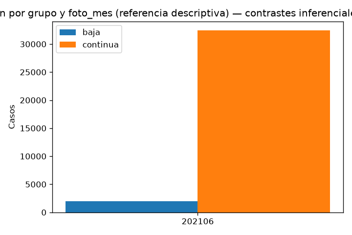

# Informe comparativo: BAJA vs CONTINUA (junio 2021, pooled)

Generado: 2026-10-04 15:39 UTC

Fuentes: `dataset_junio.parquet` (baja) y `dataset_continua_20_junio.parquet` (continua 20% por mes).

## 0. Criterios y volumen

| regla | descripcion |
| --- | --- |
| cohorte_baja | dataset_junio.parquet: BAJA+1 y BAJA+2 |
| cohorte_continua | dataset_continua_20_junio.parquet: CONTINUA, ~20% por foto_mes |
| mes | foto_mes % 100 = 6; contraste pooled (FDR por etapa) |
| grano | (numero_de_cliente, foto_mes, grupo) único |
| inferencia | tests por variable (cohorte junio); FDR Benjamini–Hochberg por etapa (un lote por CSV) |

### Conteos por grupo y foto_mes

| grupo | foto_mes | n_casos |
| --- | --- | --- |
| baja | 202106 | 1972 |
| continua | 202106 | 32429 |

- Filas baja: 1972; filas continua: 32429; total apilado: 34401.



### Validación del stack

| chequeo | ok | detalle |
| --- | --- | --- |
| columnas_esperadas_712 | True | 712 |
| claves_unicas_grupo | True | duplicados=0 |
| solo_junio | True | [202106] |
| baja_un_foto_por_cliente | True | 1972 filas |
| continua_solo_clase | True | 32429/32429 |

## 1. Balance y subtipos BAJA

Dentro de `grupo=baja`, la cohorte mezcla `BAJA+1` y `BAJA+2`. No se contrastan esas clases como etapa principal.

Ver `tablas/etapa1_baja_clase_ternaria.csv`.

## 2–4. Nocontinuas (base, lag1, lag2)

Por cada variable (cohorte junio): prevalencia o mediana por grupo; chi-cuadrado/Fisher (0/1) o Mann–Whitney; efecto = baja − continua; FDR Benjamini–Hochberg por etapa (un lote por CSV).

| Artefacto | Variables |
| --- | --- |
| `etapa2_nocontinuas_base.csv` | capa base |
| `etapa3_nocontinuas_lag1.csv` | t−1 |
| `etapa4_nocontinuas_lag2.csv` | t−2 |

Los lags capturan historia reciente frente al mes actual de la foto.

## 5–6. Rankings percentiles (126 columnas por capa)

Mann–Whitney sobre `pct_*`, `lag1_pct_*`, `lag2_pct_*`, `delta1_pct_*`, `delta2_pct_*`. Efecto reportado: Δ mediana (baja − continua).

| grupo | n_columnas |
| --- | --- |
| claves | 3 |
| nocontinuas_base | 26 |
| nocontinuas_lag1 | 26 |
| nocontinuas_lag2 | 26 |
| rankings_delta1_pct | 126 |
| rankings_delta2_pct | 126 |
| rankings_lag1_pct | 126 |
| rankings_lag2_pct | 126 |
| rankings_pct | 126 |

Significativos FDR (q < 0,05) por capa (una fila por variable):

| grupo_columnas | n_q_lt_0_05 |
| --- | --- |
| nocontinuas_base | 21 |
| nocontinuas_lag1 | 19 |
| nocontinuas_lag2 | 19 |
| rankings_pct | 103 |
| rankings_lag1_pct | 101 |
| rankings_lag2_pct | 98 |
| rankings_delta1_pct | 57 |
| rankings_delta2_pct | 65 |

## 7. Síntesis de señal

Top 20 efectos globales (|efecto|) unificando etapas 2–6:

| grupo_columnas | variable | foto_mes | efecto | p_value | q_value | test |
| --- | --- | --- | --- | --- | --- | --- |
| rankings_lag1_pct | lag1_pct_mcomisiones_mantenimiento | junio_pooled | 0.735136 | 0.000000 | 0.000000 | mann_whitney |
| rankings_pct | pct_mcomisiones_mantenimiento | junio_pooled | 0.706885 | 0.000000 | 0.000000 | mann_whitney |
| rankings_lag2_pct | lag2_pct_mcomisiones_mantenimiento | junio_pooled | 0.688975 | 0.000000 | 0.000000 | mann_whitney |
| rankings_lag1_pct | lag1_pct_ccomisiones_mantenimiento | junio_pooled | 0.684680 | 0.000000 | 0.000000 | mann_whitney |
| rankings_pct | pct_ccomisiones_mantenimiento | junio_pooled | 0.678904 | 0.000000 | 0.000000 | mann_whitney |
| rankings_lag2_pct | lag2_pct_ccomisiones_mantenimiento | junio_pooled | 0.661404 | 0.000000 | 0.000000 | mann_whitney |
| rankings_lag2_pct | lag2_pct_ctarjeta_debito_transacciones | junio_pooled | -0.512895 | 0.000000 | 0.000000 | mann_whitney |
| rankings_lag2_pct | lag2_pct_mtransferencias_recibidas | junio_pooled | -0.511510 | 0.000000 | 0.000000 | mann_whitney |
| rankings_lag2_pct | lag2_pct_mpagomiscuentas | junio_pooled | -0.511162 | 0.000000 | 0.000000 | mann_whitney |
| rankings_lag2_pct | lag2_pct_cpagomiscuentas | junio_pooled | -0.510984 | 0.000000 | 0.000000 | mann_whitney |
| rankings_lag2_pct | lag2_pct_mtransferencias_emitidas | junio_pooled | -0.509594 | 0.000000 | 0.000000 | mann_whitney |
| rankings_lag2_pct | lag2_pct_mautoservicio | junio_pooled | -0.509413 | 0.000000 | 0.000000 | mann_whitney |
| rankings_lag2_pct | lag2_pct_mpayroll | junio_pooled | -0.508911 | 0.000000 | 0.000000 | mann_whitney |
| rankings_lag2_pct | lag2_pct_mttarjeta_visa_debitos_automaticos | junio_pooled | -0.508687 | 0.000000 | 0.000000 | mann_whitney |
| rankings_lag1_pct | lag1_pct_mautoservicio | junio_pooled | -0.508472 | 0.000000 | 0.000000 | mann_whitney |
| rankings_lag1_pct | lag1_pct_mtransferencias_recibidas | junio_pooled | -0.508295 | 0.000000 | 0.000000 | mann_whitney |
| rankings_lag1_pct | lag1_pct_mtarjeta_visa_consumo | junio_pooled | -0.508253 | 0.000000 | 0.000000 | mann_whitney |
| rankings_lag1_pct | lag1_pct_cextraccion_autoservicio | junio_pooled | -0.507770 | 0.000000 | 0.000000 | mann_whitney |
| rankings_lag1_pct | lag1_pct_mextraccion_autoservicio | junio_pooled | -0.507770 | 0.000000 | 0.000000 | mann_whitney |
| rankings_pct | pct_mautoservicio | junio_pooled | -0.507303 | 0.000000 | 0.000000 | mann_whitney |

Tabla completa: `tablas/resumen_top_efectos.csv`.

### Lectura por dominio

Nocontinuas base (26 flags/conteos): productos, tarjetas, seguros y digital (`thomebanking`, `cmobile_app_trx`, …). Rankings `pct_*` y capas lag/delta: rentabilidad, saldos, comisiones y dinámica mes a mes.

Comparar `delta*_pct_*` con niveles `pct_*` ayuda a separar posición relativa intra-mes de cambio respecto a lags.

### Limitaciones

- CONTINUA es ~20% del universo por mes: alto poder estadístico; priorizar **tamaño de efecto** además de `q_value`.
- Con un solo `foto_mes`, el modo pooled difiere del estratificado solo en la agrupación FDR (etapa vs etapa×mes).
- Los `pct_*` son `PERCENT_RANK` intra-mes (junio 2021).
- BAJA agrega `BAJA+1` y `BAJA+2` sin estratificar en la inferencia principal.

## Ejecución

```bash
cd juara/miranda/junio
uv run python prep/join_junio.py
uv run python prep/join_continua_20_junio.py
cd pipelines/describe_comparativo && uv run python run_comparativo.py --pool-mes
```
