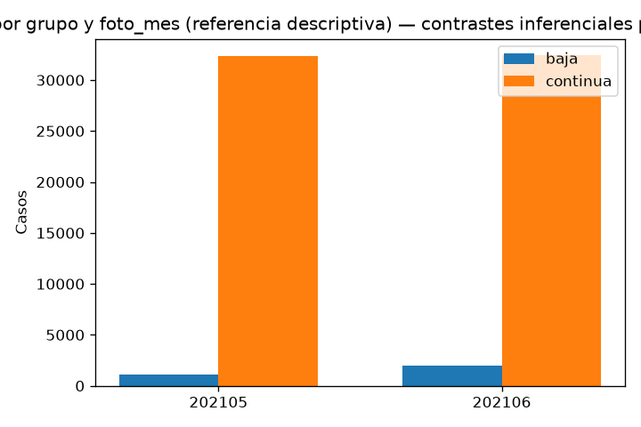

# Informe comparativo: BAJA vs CONTINUA (mayo–junio, pooled)

Generado: 2026-10-03 14:51 UTC

Fuentes: `dataset_mayo_junio.parquet` (baja) y `dataset_continua_20_mayo_junio.parquet` (continua 20% por mes).

## 0. Criterios y volumen

| regla | descripcion |
| --- | --- |
| cohorte_baja | dataset_mayo_junio.parquet: mayo BAJA+1; junio BAJA+1 y BAJA+2 |
| cohorte_continua | dataset_continua_20_mayo_junio.parquet: CONTINUA, ~20% por foto_mes |
| mes | foto_mes % 100 IN (5, 6); contrastes apilados mayo+junio |
| grano | (numero_de_cliente, foto_mes, grupo) único |
| inferencia | tests por variable apilando mayo+junio; FDR Benjamini–Hochberg por etapa (un lote por CSV) |

### Conteos por grupo y foto_mes

| grupo | foto_mes | n_casos |
| --- | --- | --- |
| baja | 202105 | 1143 |
| baja | 202106 | 1972 |
| continua | 202105 | 32351 |
| continua | 202106 | 32429 |

- Filas baja: 3115; filas continua: 64780; total apilado: 67895.



### Validación del stack

| chequeo | ok | detalle |
| --- | --- | --- |
| columnas_esperadas_712 | True | 712 |
| claves_unicas_grupo | True | duplicados=0 |
| solo_mayo_junio | True | [202105, 202106] |
| baja_un_foto_por_cliente | True | 3115 filas |
| continua_solo_clase | True | 64780/64780 |

## 1. Balance y subtipos BAJA

Dentro de `grupo=baja`, mayo concentra `BAJA+1`; junio mezcla `BAJA+1` y `BAJA+2`. No se contrastan esas clases como etapa principal.

Ver `tablas/etapa1_baja_clase_ternaria.csv`.

## 2–4. Nocontinuas (base, lag1, lag2)

Por cada variable (mayo+junio apilados): prevalencia o mediana por grupo; chi-cuadrado/Fisher (0/1) o Mann–Whitney; efecto = baja − continua; FDR Benjamini–Hochberg por etapa (un lote por CSV).

| Artefacto | Variables |
| --- | --- |
| `etapa2_nocontinuas_base.csv` | capa base |
| `etapa3_nocontinuas_lag1.csv` | t−1 |
| `etapa4_nocontinuas_lag2.csv` | t−2 |

Los lags capturan historia reciente frente al mes actual de la foto.

## 5–6. Rankings percentiles (126 columnas por capa)

Mann–Whitney sobre `pct_*`, `lag1_pct_*`, `lag2_pct_*`, `delta1_pct_*`, `delta2_pct_*`. Efecto reportado: Δ mediana (baja − continua).

| grupo | n_columnas |
| --- | --- |
| claves | 3 |
| nocontinuas_base | 26 |
| nocontinuas_lag1 | 26 |
| nocontinuas_lag2 | 26 |
| rankings_delta1_pct | 126 |
| rankings_delta2_pct | 126 |
| rankings_lag1_pct | 126 |
| rankings_lag2_pct | 126 |
| rankings_pct | 126 |

Significativos FDR (q < 0,05) por capa (una fila por variable):

| grupo_columnas | n_q_lt_0_05 |
| --- | --- |
| nocontinuas_base | 23 |
| nocontinuas_lag1 | 21 |
| nocontinuas_lag2 | 22 |
| rankings_pct | 107 |
| rankings_lag1_pct | 106 |
| rankings_lag2_pct | 105 |
| rankings_delta1_pct | 70 |
| rankings_delta2_pct | 80 |

## 7. Síntesis de señal

Top 20 efectos globales (|efecto|) unificando etapas 2–6:

| grupo_columnas | variable | foto_mes | efecto | p_value | q_value | test |
| --- | --- | --- | --- | --- | --- | --- |
| rankings_lag1_pct | lag1_pct_mcomisiones_mantenimiento | mayo_junio_pooled | 0.714981 | 0.000000 | 0.000000 | mann_whitney |
| rankings_lag2_pct | lag2_pct_mcomisiones_mantenimiento | mayo_junio_pooled | 0.688975 | 0.000000 | 0.000000 | mann_whitney |
| rankings_pct | pct_mcomisiones_mantenimiento | mayo_junio_pooled | 0.687340 | 0.000000 | 0.000000 | mann_whitney |
| rankings_pct | pct_ccomisiones_mantenimiento | mayo_junio_pooled | 0.678904 | 0.000000 | 0.000000 | mann_whitney |
| rankings_lag1_pct | lag1_pct_ccomisiones_mantenimiento | mayo_junio_pooled | 0.661404 | 0.000000 | 0.000000 | mann_whitney |
| rankings_lag2_pct | lag2_pct_ccomisiones_mantenimiento | mayo_junio_pooled | 0.661404 | 0.000000 | 0.000000 | mann_whitney |
| rankings_lag2_pct | lag2_pct_mpagomiscuentas | mayo_junio_pooled | -0.512299 | 0.000000 | 0.000000 | mann_whitney |
| rankings_lag2_pct | lag2_pct_mautoservicio | mayo_junio_pooled | -0.511676 | 0.000000 | 0.000000 | mann_whitney |
| rankings_lag2_pct | lag2_pct_mtransferencias_recibidas | mayo_junio_pooled | -0.510457 | 0.000000 | 0.000000 | mann_whitney |
| rankings_lag1_pct | lag1_pct_mautoservicio | mayo_junio_pooled | -0.509796 | 0.000000 | 0.000000 | mann_whitney |
| rankings_lag2_pct | lag2_pct_mpayroll | mayo_junio_pooled | -0.509665 | 0.000000 | 0.000000 | mann_whitney |
| rankings_lag1_pct | lag1_pct_mtransferencias_recibidas | mayo_junio_pooled | -0.509511 | 0.000000 | 0.000000 | mann_whitney |
| rankings_lag1_pct | lag1_pct_mpayroll | mayo_junio_pooled | -0.509279 | 0.000000 | 0.000000 | mann_whitney |
| rankings_lag2_pct | lag2_pct_mtransferencias_emitidas | mayo_junio_pooled | -0.508831 | 0.000000 | 0.000000 | mann_whitney |
| rankings_lag2_pct | lag2_pct_mttarjeta_visa_debitos_automaticos | mayo_junio_pooled | -0.508364 | 0.000000 | 0.000000 | mann_whitney |
| rankings_pct | pct_mautoservicio | mayo_junio_pooled | -0.507750 | 0.000000 | 0.000000 | mann_whitney |
| rankings_lag2_pct | lag2_pct_cpagomiscuentas | mayo_junio_pooled | -0.507566 | 0.000000 | 0.000000 | mann_whitney |
| rankings_lag2_pct | lag2_pct_mtarjeta_visa_consumo | mayo_junio_pooled | -0.507358 | 0.000000 | 0.000000 | mann_whitney |
| rankings_lag1_pct | lag1_pct_mtarjeta_visa_consumo | mayo_junio_pooled | -0.507283 | 0.000000 | 0.000000 | mann_whitney |
| rankings_pct | pct_mextraccion_autoservicio | mayo_junio_pooled | -0.507132 | 0.000000 | 0.000000 | mann_whitney |

Tabla completa: `tablas/resumen_top_efectos.csv`.

### Lectura por dominio

Nocontinuas base (26 flags/conteos): productos, tarjetas, seguros y digital (`thomebanking`, `cmobile_app_trx`, …). Rankings `pct_*` y capas lag/delta: rentabilidad, saldos, comisiones y dinámica mes a mes.

Comparar `delta*_pct_*` con niveles `pct_*` ayuda a separar posición relativa intra-mes de cambio respecto a lags.

### Limitaciones

- CONTINUA es ~20% del universo por mes: alto poder estadístico; priorizar **tamaño de efecto** además de `q_value`.
- Los contrastes apilan filas de mayo y junio; la mezcla de cohortes BAJA (`BAJA+1` / `BAJA+2` en junio) no se estratifica en la inferencia.
- Los `pct_*` (y capas lag/delta derivadas) se calcularon como `PERCENT_RANK` **intra-mes**; al contrastar grupos pooled, baja y continua de un mismo mes comparten escala, pero mayo y junio no son comparables en nivel absoluto del percentil.
- BAJA en junio agrega `BAJA+1` y `BAJA+2`.

## Ejecución

```bash
cd juara/miranda/mayo_junio
uv run python prep/join_mayo_junio.py
uv run python prep/join_continua_20_mayo_junio.py
cd pipelines/describe_comparativo && uv run python run_comparativo.py --pool-mes
```
