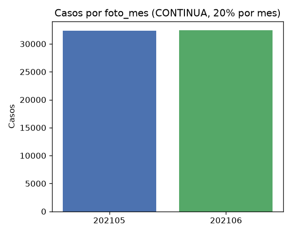
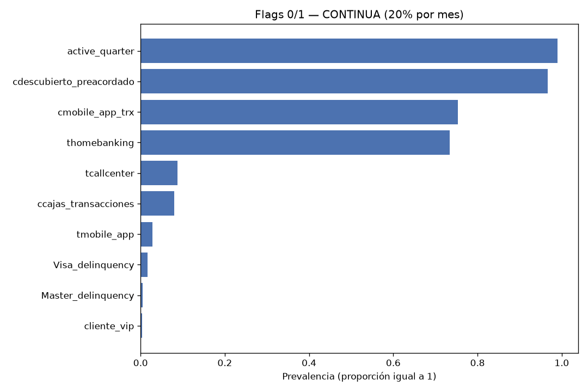
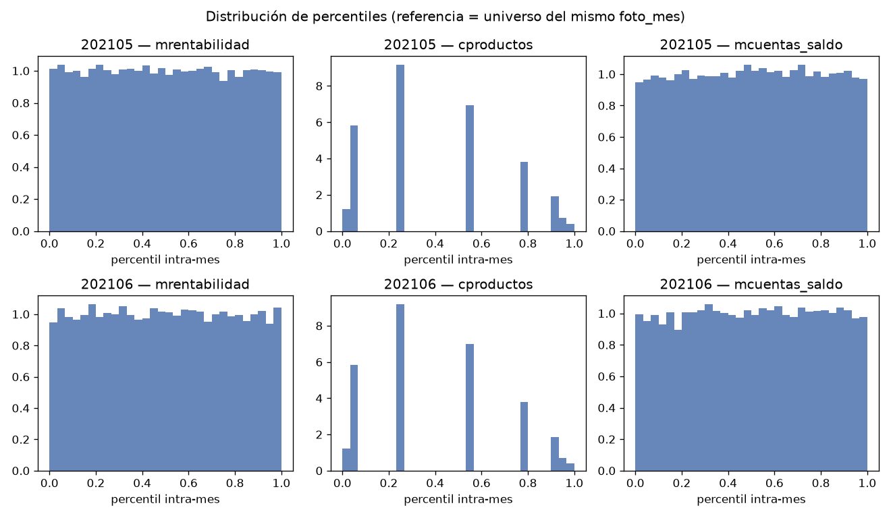

# Informe descriptivo: CONTINUA (20% por mes, mayo–junio)

Generado: 2026-10-03 13:59 UTC

Fuente: `dataset_continua_20_mayo_junio.parquet` (construido con `join_continua_20_mayo_junio.py`).

## 1. Criterios de selección

| regla | descripcion |
| --- | --- |
| mes | foto_mes % 100 IN (5, 6) |
| clase | solo CONTINUA |
| muestra | 20% de casos por foto_mes (ceil(n×0.2), hash reproducible) |
| clave_grano | (numero_de_cliente, foto_mes) único por fila |
| analisis | cohorte unificada CONTINUA muestreada |

Cohorte `CONTINUA` en mayo y junio; el join aplica ~20% de casos **por** `foto_mes` (misma lógica que `join_continua_20_mayo_junio.py`).

## 2. Volumen y grano

| metrica | valor |
| --- | --- |
| filas | 64780 |
| columnas | 711 |
| clientes_distintos | 58413 |
| foto_mes_distintos | 2 |

64780 observaciones cliente–mes (`CONTINUA`); 58413 clientes distintos (52046 con una sola foto en la muestra).

### Conteo por foto_mes

| foto_mes | n_casos |
| --- | --- |
| 202105 | 32351 |
| 202106 | 32429 |

- `202105`: 32351 casos.
- `202106`: 32429 casos.



## 3. Validación del parquet

| chequeo | ok | detalle |
| --- | --- | --- |
| filas_igual_suma_por_mes | True | 64780 vs 64780 |
| claves_unicas | True | duplicados=0 |
| solo_mayo_junio | True | [202105, 202106] |
| columnas_esperadas_711 | True | 711 |
| solo_clase_continua | True | 64780/64780 |
| clientes_distintos_leq_filas | True | clientes=58413, filas=64780 |

## 4. Estructura de columnas

| grupo | n_columnas |
| --- | --- |
| claves | 3 |
| nocontinuas_base | 26 |
| nocontinuas_lag1 | 26 |
| nocontinuas_lag2 | 26 |
| rankings_delta1_pct | 126 |
| rankings_delta2_pct | 126 |
| rankings_lag1_pct | 126 |
| rankings_lag2_pct | 126 |
| rankings_pct | 126 |

Las columnas `pct_*` son `PERCENT_RANK` **por** `foto_mes` (ver `build_rankings.py`). No se promedian entre meses en una sola escala: los estadísticos de la sección 6 se calculan por `foto_mes`. Los prefijos `lag1_` / `lag2_` y `delta1_pct_` / `delta2_pct_` provienen de capas de historia y variación.

## 5. Variables nocontinuas (capa base)

Flags estrictamente 0/1 (`max_val <= 1` en la cohorte); las doce mayores prevalencias:

| variable | prevalencia |
| --- | --- |
| active_quarter | 0.990 |
| cdescubierto_preacordado | 0.967 |
| cmobile_app_trx | 0.754 |
| thomebanking | 0.734 |
| tcallcenter | 0.087 |
| ccajas_transacciones | 0.080 |
| tmobile_app | 0.029 |
| Visa_delinquency | 0.016 |
| Master_delinquency | 0.004 |
| cliente_vip | 0.004 |

Variables con valores múltiples (media y máximo en la cohorte):

| variable | media | max_val |
| --- | --- | --- |
| ctarjeta_debito | 1.483 | 13 |
| tcuentas | 1.005 | 2 |
| ccuenta_corriente | 1.003 | 2 |
| ctarjeta_visa | 0.956 | 3 |
| ctarjeta_master | 0.900 | 2 |
| cseguro_accidentes_personales | 0.139 | 5 |
| cseguro_vivienda | 0.132 | 4 |
| cseguro_vida | 0.116 | 3 |



Medias y prevalencias por `foto_mes` y cohorte `todos` (variables brutas): `tablas/resumen_nocontinuas.csv`.

## 6. Percentiles de variables continuas

Por `foto_mes` (cada valor `pct_*` es relativo al universo de competencia de ese mes):

| foto_mes | variable | media | p50 | p90 |
| --- | --- | --- | --- | --- |
| 202105 | pct_chomebanking_transacciones | 0.488 | 0.500 | 0.900 |
| 202105 | pct_cliente_antiguedad | 0.498 | 0.497 | 0.899 |
| 202105 | pct_cliente_edad | 0.487 | 0.482 | 0.889 |
| 202105 | pct_cproductos | 0.401 | 0.240 | 0.901 |
| 202105 | pct_ctrx_quarter | 0.505 | 0.504 | 0.901 |
| 202105 | pct_mautoservicio | 0.462 | 0.508 | 0.901 |
| 202105 | pct_mcomisiones | 0.498 | 0.493 | 0.900 |
| 202105 | pct_mcuentas_saldo | 0.503 | 0.504 | 0.899 |
| 202105 | pct_mpayroll | 0.402 | 0.507 | 0.901 |
| 202105 | pct_mrentabilidad | 0.498 | 0.497 | 0.900 |
| 202105 | pct_mrentabilidad_annual | 0.500 | 0.499 | 0.903 |
| 202106 | pct_chomebanking_transacciones | 0.487 | 0.496 | 0.902 |
| 202106 | pct_cliente_antiguedad | 0.497 | 0.499 | 0.900 |
| 202106 | pct_cliente_edad | 0.487 | 0.482 | 0.889 |
| 202106 | pct_cproductos | 0.398 | 0.238 | 0.775 |
| 202106 | pct_ctrx_quarter | 0.504 | 0.506 | 0.901 |
| 202106 | pct_mautoservicio | 0.464 | 0.507 | 0.900 |
| 202106 | pct_mcomisiones | 0.500 | 0.497 | 0.901 |
| 202106 | pct_mcuentas_saldo | 0.503 | 0.505 | 0.899 |
| 202106 | pct_mpayroll | 0.401 | 0.505 | 0.900 |
| 202106 | pct_mrentabilidad | 0.500 | 0.500 | 0.900 |
| 202106 | pct_mrentabilidad_annual | 0.500 | 0.500 | 0.900 |

No son montos absolutos. Mezclar filas de distintos `foto_mes` en un solo histograma o media global distorsionaría la interpretación.



Tabla completa: `tablas/percentiles_variables_pct.csv`.

## 7. Ejecución

Desde `juara/miranda/mayo_junio/`:

```bash
uv run python prep/join_continua_20_mayo_junio.py
cd pipelines/describe_casos && uv run python run_descriptivo_continua_20.py
```

| Artefacto | Descripción |
| --- | --- |
| `tablas/*.csv` | Tablas del análisis |
| `plots/*.png` | Gráficos referenciados |
| `informe_casos_continua_20_mayo_junio.md` | Este informe |
