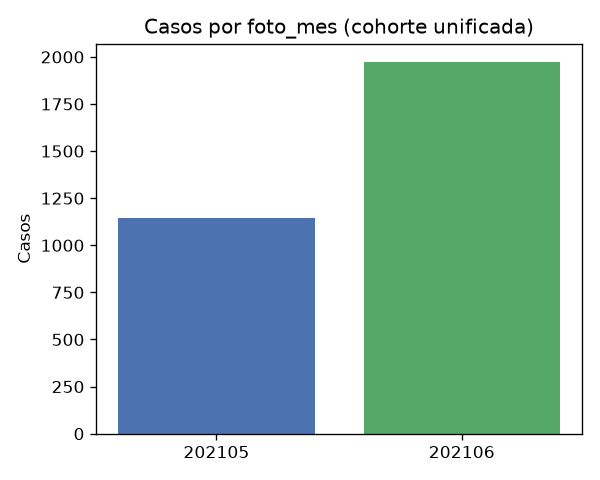
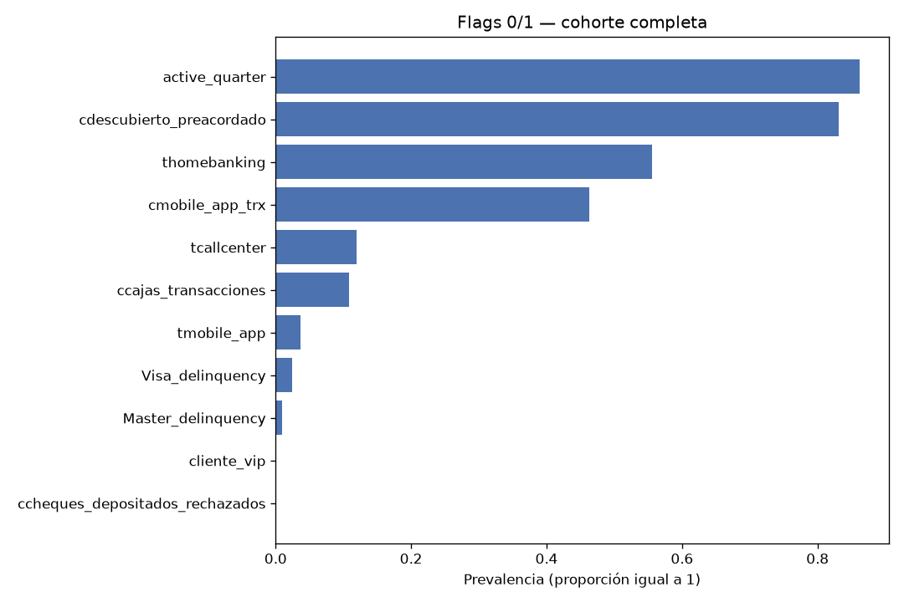
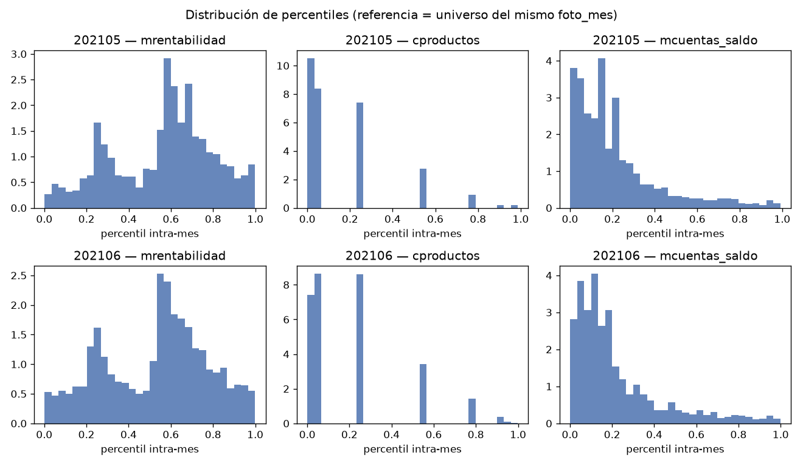

# Informe descriptivo: casos seleccionados (mayo–junio)

Generado: 2026-10-03 13:59 UTC

Fuente: `dataset_mayo_junio.parquet` (construido con `join_mayo_junio.py`).

## 1. Criterios de selección

| regla | descripcion |
| --- | --- |
| mes | foto_mes % 100 IN (5, 6) |
| mayo_clase | solo BAJA+1 |
| junio_clase | BAJA+1 y BAJA+2 |
| clave_grano | (numero_de_cliente, foto_mes) único por fila |
| analisis | cohorte unificada; no se estratifica por clase_ternaria |

El parquet incluye `clase_ternaria` como variable de etiqueta; el perfil descriptivo trata la muestra como una sola cohorte.

## 2. Volumen y grano

| metrica | valor |
| --- | --- |
| filas | 3115 |
| columnas | 711 |
| clientes_distintos | 3115 |
| foto_mes_distintos | 2 |

3115 observaciones cliente–mes; cada uno de los 3115 clientes aparece en un único `foto_mes`.

### Conteo por foto_mes

| foto_mes | n_casos |
| --- | --- |
| 202105 | 1143 |
| 202106 | 1972 |

- `202105`: 1143 casos.
- `202106`: 1972 casos.



## 3. Validación del parquet

| chequeo | ok | detalle |
| --- | --- | --- |
| filas_igual_suma_por_mes | True | 3115 vs 3115 |
| claves_unicas | True | duplicados=0 |
| solo_mayo_junio | True | [202105, 202106] |
| columnas_esperadas_711 | True | 711 |
| un_foto_mes_por_cliente | True | 3115/3115 |

## 4. Estructura de columnas

| grupo | n_columnas |
| --- | --- |
| claves | 3 |
| nocontinuas_base | 26 |
| nocontinuas_lag1 | 26 |
| nocontinuas_lag2 | 26 |
| rankings_delta1_pct | 126 |
| rankings_delta2_pct | 126 |
| rankings_lag1_pct | 126 |
| rankings_lag2_pct | 126 |
| rankings_pct | 126 |

Las columnas `pct_*` son `PERCENT_RANK` **por** `foto_mes` (ver `build_rankings.py`). No se promedian entre meses en una sola escala: los estadísticos de la sección 6 se calculan por `foto_mes`. Los prefijos `lag1_` / `lag2_` y `delta1_pct_` / `delta2_pct_` provienen de capas de historia y variación.

## 5. Variables nocontinuas (capa base)

Flags estrictamente 0/1 (`max_val <= 1` en la cohorte); las doce mayores prevalencias:

| variable | prevalencia |
| --- | --- |
| active_quarter | 0.862 |
| cdescubierto_preacordado | 0.832 |
| thomebanking | 0.556 |
| cmobile_app_trx | 0.463 |
| tcallcenter | 0.119 |
| ccajas_transacciones | 0.108 |
| tmobile_app | 0.036 |
| Visa_delinquency | 0.024 |
| Master_delinquency | 0.010 |
| cliente_vip | 0.001 |
| ccheques_depositados_rechazados | 0.001 |

Variables con valores múltiples (media y máximo en la cohorte):

| variable | media | max_val |
| --- | --- | --- |
| ctarjeta_debito | 1.438 | 7 |
| tcuentas | 1.013 | 2 |
| ccuenta_corriente | 1.001 | 2 |
| ctarjeta_visa | 0.693 | 2 |
| Visa_status | 0.682 | 9 |
| Master_status | 0.671 | 9 |
| ctarjeta_master | 0.623 | 2 |
| internet | 0.204 | 3 |



Medias y prevalencias por `foto_mes` y cohorte `todos` (variables brutas): `tablas/resumen_nocontinuas.csv`.

## 6. Percentiles de variables continuas

Por `foto_mes` (cada valor `pct_*` es relativo al universo de competencia de ese mes):

| foto_mes | variable | media | p50 | p90 |
| --- | --- | --- | --- | --- |
| 202105 | pct_chomebanking_transacciones | 0.251 | 0.157 | 0.722 |
| 202105 | pct_cliente_antiguedad | 0.397 | 0.338 | 0.820 |
| 202105 | pct_cliente_edad | 0.495 | 0.482 | 0.913 |
| 202105 | pct_cproductos | 0.159 | 0.044 | 0.547 |
| 202105 | pct_ctrx_quarter | 0.133 | 0.055 | 0.397 |
| 202105 | pct_mautoservicio | 0.102 | 0.000 | 0.445 |
| 202105 | pct_mcomisiones | 0.525 | 0.643 | 0.843 |
| 202105 | pct_mcuentas_saldo | 0.215 | 0.156 | 0.505 |
| 202105 | pct_mpayroll | 0.037 | 0.000 | 0.000 |
| 202105 | pct_mrentabilidad | 0.564 | 0.600 | 0.850 |
| 202105 | pct_mrentabilidad_annual | 0.484 | 0.458 | 0.837 |
| 202106 | pct_chomebanking_transacciones | 0.283 | 0.224 | 0.737 |
| 202106 | pct_cliente_antiguedad | 0.421 | 0.364 | 0.861 |
| 202106 | pct_cliente_edad | 0.505 | 0.511 | 0.923 |
| 202106 | pct_cproductos | 0.197 | 0.043 | 0.545 |
| 202106 | pct_ctrx_quarter | 0.161 | 0.075 | 0.479 |
| 202106 | pct_mautoservicio | 0.117 | 0.000 | 0.489 |
| 202106 | pct_mcomisiones | 0.523 | 0.632 | 0.881 |
| 202106 | pct_mcuentas_saldo | 0.218 | 0.146 | 0.524 |
| 202106 | pct_mpayroll | 0.041 | 0.000 | 0.000 |
| 202106 | pct_mrentabilidad | 0.530 | 0.571 | 0.850 |
| 202106 | pct_mrentabilidad_annual | 0.483 | 0.472 | 0.821 |

No son montos absolutos. Mezclar filas de distintos `foto_mes` en un solo histograma o media global distorsionaría la interpretación.



Tabla completa: `tablas/percentiles_variables_pct.csv`.

## 7. Ejecución

Desde `juara/miranda/mayo_junio/`:

```bash
uv run python prep/join_mayo_junio.py
cd pipelines/describe_casos && uv run python run_descriptivo.py
```

| Artefacto | Descripción |
| --- | --- |
| `tablas/*.csv` | Tablas del análisis |
| `plots/*.png` | Gráficos referenciados |
| `informe_casos_mayo_junio.md` | Este informe |
